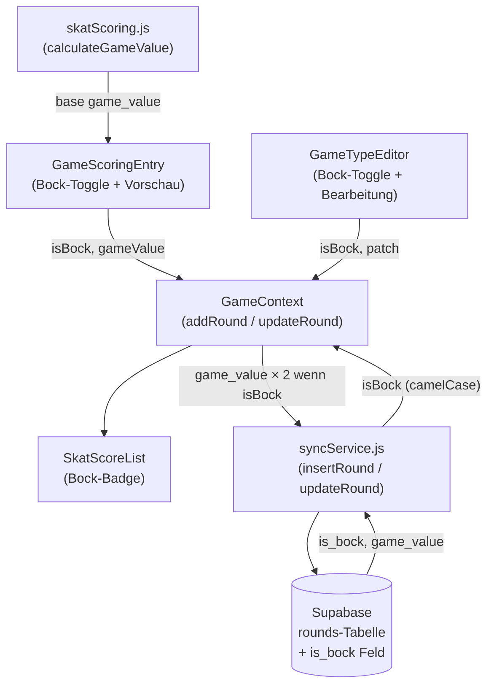

# Design Document: Bockrunden

## Overview

Das Feature „Bockrunden" ergänzt die Skat-Scoring-App um die Möglichkeit, einzelne Spielrunden als Bockrunden zu markieren. Bei einer Bockrunde wird der berechnete Spielwert verdoppelt – sowohl bei Sieg als auch bei Niederlage. Die Erkennung liegt beim Nutzer (manueller Toggle), da die App keine automatische Erkennung von Bock-auslösenden Ereignissen implementiert.

Die Implementierung folgt dem Prinzip des minimalen Eingriffs: Der Bock-Faktor wird einmalig beim Speichern auf den `game_value` angewendet. Alle nachgelagerten Berechnungen (Gesamtpunkte, Seeger-Fabian, Rangliste) arbeiten unverändert mit dem gespeicherten `game_value` weiter.

### Designentscheidung: Verdopplung beim Speichern

Der Bock-Spielwert wird nicht als separates Feld gespeichert, sondern direkt als `game_value` persistiert. Das bedeutet:

- `game_value` bei Bockrunden = `base_game_value × 2`
- `is_bock = true` dient als Metadaten-Flag (für Anzeige und Bearbeitung)
- Alle bestehenden Berechnungen (`getPlayerTotals`, `getSeegerTotals`) bleiben unverändert korrekt

**Rationale:** Minimale Änderungen an bestehender Logik, keine Migration bestehender Berechnungspfade nötig.

---

## Architecture



Der Datenfluss ist einseitig: Die Bock-Verdopplung findet in `GameContext.addRound` bzw. `GameContext.updateRound` statt, bevor der Wert an `syncService` übergeben wird.

---

## Components and Interfaces

### GameScoringEntry (`src/pages/GameScoringEntry.jsx`)

Änderungen:
- Neuer lokaler State: `const [isBock, setIsBock] = useState(false)`
- Neuer Toggle-Chip „Bockrunde" in der Spielstufe-Sektion
- `result`-Berechnung bleibt unverändert (liefert `base_game_value`)
- Anzeige im Ergebnis-Dashboard: Wenn `isBock`, zusätzliche Breakdown-Zeile „Bockrunde ×2" und angezeigter Wert = `result.gameValue × 2`
- `handleCommit` übergibt `isBock` an `addRound`
- `resetForm` setzt `isBock` auf `false`

### GameTypeEditor (`src/components/GameTypeEditor.jsx`)

Änderungen:
- Neuer lokaler State: `const [isBock, setIsBock] = useState(round?.isBock ?? false)`
- Neue `CheckboxField`-Instanz „Bockrunde" im Dialog
- `handleSave` fügt `isBock` und den neu berechneten `gameValue` zum `patch` hinzu

### GameContext (`src/context/GameContext.jsx`)

Änderungen im Reducer (`ADD_ROUND`):
```js
const finalGameValue = action.payload.isBock
  ? action.payload.gameValue * 2
  : action.payload.gameValue;
const round = {
  id: state.rounds.length + 1,
  ...action.payload,
  gameValue: finalGameValue,
  isBock: action.payload.isBock ?? false,
  timestamp: new Date().toISOString(),
};
```

Änderungen in `updateRound`:
- `isBock` und `game_value` werden in den erlaubten Feldern von `syncService.updateRound` ergänzt
- Snake-Case-Mapping: `isBock` → `is_bock`, `gameValue` → `game_value`

Änderungen in `loadSession` (Mapping):
```js
isBock: r.is_bock ?? false,
```

### SyncService (`src/lib/syncService.js`)

Änderungen in `insertRound`:
```js
is_bock: round.isBock ?? false,
```

Änderungen in `updateRound` (erlaubte Felder):
```js
const allowed = ['game_type', 'type_label', 'hand', 'ouvert', 'schneider', 'schwarz', 'spitzen', 'is_bock', 'game_value'];
```

Änderungen in `loadSession` (Mapping):
```js
isBock: r.is_bock ?? false,
```

### SkatScoreList (`src/pages/SkatScoreList.jsx`)

Änderungen:
- Wenn `r.isBock === true`, wird neben dem Spielwert ein Badge/Label „Bock" gerendert

---

## Data Models

### Erweiterung der `rounds`-Tabelle

```sql
ALTER TABLE rounds
  ADD COLUMN IF NOT EXISTS is_bock boolean NOT NULL DEFAULT false;
```

Migration: `supabase/migrations/003_add_bock_field.sql`

### Rundenobjekt (lokaler State)

```ts
interface Round {
  id: number;
  player: string;
  gameType: string;
  typeLabel: string;
  gameValue: number;       // Bei Bockrunden: base_game_value × 2
  baseValue: number;
  multiplier: number;
  won: boolean;
  eyeCount: number;
  spitzen: number;
  hand: boolean;
  schneider: boolean;
  schwarz: boolean;
  ouvert: boolean;
  isBock: boolean;         // NEU
  roles: { geber, hoeren, sagen };
  seegerScores: Record<string, number>;
  timestamp: string;
  _dbId?: string;
  session_id?: string;
}
```

### Bock-Spielwert-Berechnung

```
bock_game_value = game_value × 2
```

Dabei ist `game_value` der von `calculateGameValue` zurückgegebene Wert (bereits vorzeichenbehaftet: positiv bei Sieg, negativ bei Niederlage). Die Verdopplung erhält das Vorzeichen.

---

## Correctness Properties

*A property is a characteristic or behavior that should hold true across all valid executions of a system - essentially, a formal statement about what the system should do. Properties serve as the bridge between human-readable specifications and machine-verifiable correctness guarantees.*

### Property 1: Bock-Verdopplung ist korrekt

*For any* gültigen Spielkonfiguration (gameType, spitzen, hand, schneider, schwarz, ouvert, eyeCount) gilt: Wenn `isBock = true`, dann ist der gespeicherte `game_value` exakt das Doppelte des von `calculateGameValue` zurückgegebenen Werts (Vorzeichen bleibt erhalten).

**Validates: Requirements 1.2, 1.4, 2.3, 5.3**

### Property 2: Kein Bock bedeutet unveränderter Spielwert

*For any* gültigen Spielkonfiguration gilt: Wenn `isBock = false`, dann ist der gespeicherte `game_value` identisch mit dem von `calculateGameValue` zurückgegebenen Wert.

**Validates: Requirements 1.3, 1.5, 2.4**

### Property 3: Bock-Persistenz Round-Trip

*For any* Runde mit beliebigem `isBock`-Wert gilt: Nach dem Einfügen in die Datenbank und dem anschließenden Laden der Session ist `isBock` im lokalen State identisch mit dem ursprünglich gespeicherten Wert.

**Validates: Requirements 3.1, 3.2, 3.3**

### Property 4: Formular-Reset setzt Bock-Toggle zurück

*For any* Zustand des Formulars (isBock = true oder false) gilt: Nach einem Reset ist `isBock = false`.

**Validates: Requirements 1.6**

### Property 5: GameTypeEditor-Vorbeleg ist korrekt

*For any* Runde mit beliebigem `isBock`-Wert gilt: Der GameTypeEditor initialisiert seinen internen `isBock`-State mit dem Wert der übergebenen Runde.

**Validates: Requirements 2.1**

### Property 6: Bock-Badge wird für alle Bockrunden gerendert

*For any* Liste von Runden gilt: Jede Runde mit `isBock = true` wird in der SkatScoreList mit einem Bock-Badge gerendert, und keine Runde mit `isBock = false` erhält dieses Badge.

**Validates: Requirements 4.1**

### Property 7: Gesamtpunkte berücksichtigen Bock-Spielwert korrekt

*For any* Menge von Runden (mit und ohne Bockrunden) gilt: `getPlayerTotals` liefert für jeden Spieler die Summe der gespeicherten `game_value`-Felder, wobei Bockrunden bereits verdoppelt gespeichert sind.

**Validates: Requirements 5.1, 5.2**

---

## Error Handling

### Speicherfehler im GameTypeEditor (Requirement 2.5)

Wenn `updateRound` einen Fehler zurückgibt, bleibt der Dialog geöffnet und zeigt eine Fehlermeldung an. Der lokale State wird nicht zurückgesetzt.

### Fehlende `is_bock`-Spalte (Altdaten)

Beim Laden älterer Runden ohne `is_bock`-Feld wird `isBock` auf `false` defaulted (`r.is_bock ?? false`). Bestehende Runden werden nicht als Bockrunden behandelt.

### Ungültige Bock-Berechnung

Wenn `calculateGameValue` einen Fehler wirft (z. B. unbekannter `gameType`), wird der Bock-Toggle ignoriert und kein Wert gespeichert. Die bestehende Fehlerbehandlung in `GameScoringEntry` greift.

---

## Testing Strategy

### Unit Tests

Fokus auf konkrete Beispiele und Fehlerfälle:

- `GameTypeEditor` zeigt Fehlermeldung bei Speicherfehler (Requirement 2.5)
- Neue Runden ohne explizites `is_bock` erhalten `false` als Default (Requirement 3.4)
- `buildTypeLabel` bleibt unverändert korrekt (Regressions-Schutz)
- `SkatScoreList` rendert Bock-Badge nur bei `isBock = true`

### Property-Based Tests

Bibliothek: **fast-check** (bereits im JS/React-Ökosystem etabliert, passt zur bestehenden Testinfrastruktur)

Konfiguration: Mindestens **100 Iterationen** pro Property-Test.

Jeder Property-Test wird mit einem Kommentar annotiert:
`// Feature: bockrunden, Property N: <property_text>`

**Property 1 – Bock-Verdopplung ist korrekt**
Generator: Zufällige gültige Spielkonfigurationen (gameType aus den 6 Typen, spitzen 1–11, eyeCount 0–120, boolean-Flags). Assertion: `addRound({ ...config, isBock: true })` → gespeicherter `game_value === calculateGameValue(config).gameValue * 2`.
`// Feature: bockrunden, Property 1: Bock-Verdopplung ist korrekt`

**Property 2 – Kein Bock bedeutet unveränderter Spielwert**
Generator: Gleiche Konfigurationen wie Property 1. Assertion: `addRound({ ...config, isBock: false })` → `game_value === calculateGameValue(config).gameValue`.
`// Feature: bockrunden, Property 2: Kein Bock bedeutet unveränderter Spielwert`

**Property 3 – Bock-Persistenz Round-Trip**
Generator: Zufällige Runden mit `isBock` true/false. Assertion: `insertRound` dann `loadSession` → `isBock` im geladenen State identisch mit dem eingefügten Wert. (Kann als Mock-Test ohne echte DB implementiert werden.)
`// Feature: bockrunden, Property 3: Bock-Persistenz Round-Trip`

**Property 4 – Formular-Reset setzt Bock-Toggle zurück**
Generator: Beliebiger `isBock`-Zustand vor dem Reset. Assertion: Nach `resetForm()` ist `isBock === false`.
`// Feature: bockrunden, Property 4: Formular-Reset setzt Bock-Toggle zurück`

**Property 5 – GameTypeEditor-Vorbeleg ist korrekt**
Generator: Zufällige Runden mit `isBock` true/false. Assertion: Initialer State des Editors entspricht `round.isBock`.
`// Feature: bockrunden, Property 5: GameTypeEditor-Vorbeleg ist korrekt`

**Property 6 – Bock-Badge wird für alle Bockrunden gerendert**
Generator: Zufällige Listen von Runden mit gemischten `isBock`-Werten. Assertion: Jede Runde mit `isBock = true` hat Badge, keine mit `isBock = false`.
`// Feature: bockrunden, Property 6: Bock-Badge wird für alle Bockrunden gerendert`

**Property 7 – Gesamtpunkte berücksichtigen Bock-Spielwert korrekt**
Generator: Zufällige Mengen von Runden (mit und ohne Bock). Assertion: `getPlayerTotals()` = Summe aller gespeicherten `game_value`-Felder (Bockrunden bereits verdoppelt).
`// Feature: bockrunden, Property 7: Gesamtpunkte berücksichtigen Bock-Spielwert korrekt`
