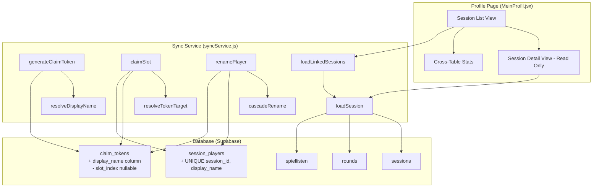
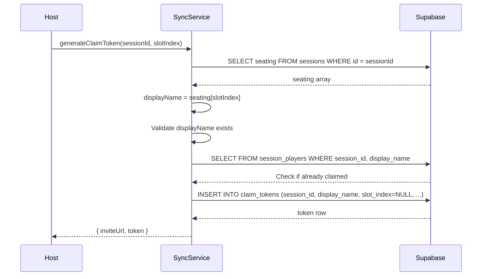
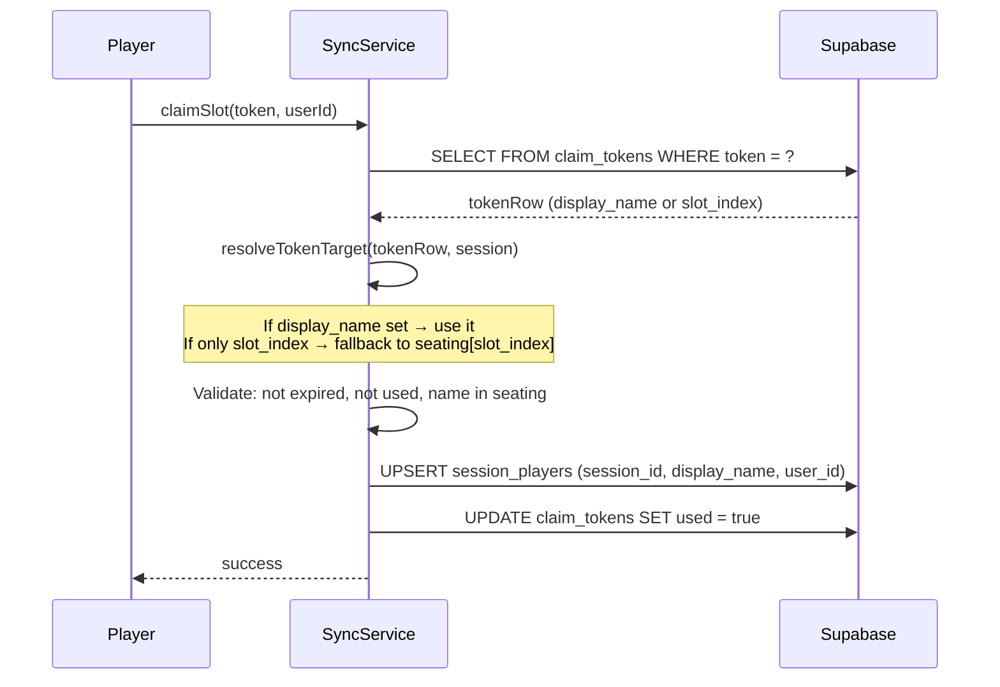

# Design Document: Claim Table Refactor

## Overview

This feature refactors the "Claim Table" system to use `display_name` as the primary identity link between user accounts and player names, replacing the volatile `slot_index`. It also upgrades the profile page to provide claimed players with read-only access to the full table data (all rounds, Skatliste, statistics) — the same view the host sees, minus write controls.

### Key Design Decisions

1. **`display_name` as the stable identity key**: Player names are semantically meaningful and stable (only change on explicit rename), unlike `slot_index` which changes on every drag-and-drop reorder.
2. **Additive migration**: The `claim_tokens` table gains a `display_name` column while `slot_index` becomes nullable. A CHECK constraint ensures at least one is set. No existing data is modified.
3. **Cascade on rename**: When a host renames a player, the rename propagates to `session_players` and pending `claim_tokens` to maintain link integrity.
4. **Full session loading for claimed players**: The existing `loadSession` function is reused for the detail view, authorized by existing RLS policies that grant SELECT access to claimed players.
5. **Pure logic separation**: All new business logic (validation, name resolution, stats computation) lives in `src/lib/` as pure functions, keeping them testable with fast-check.

---

## Architecture



### Data Flow: Claim Token Generation (New)



### Data Flow: Claim Operation (Refactored)



---

## Components and Interfaces

### Modified: `syncService.js`

| Function | Change | Purpose |
|----------|--------|---------|
| `generateClaimToken(sessionId, slotIndex)` | Refactored | Resolves `display_name` from `seating[slotIndex]`, validates name exists and isn't already claimed, inserts token with `display_name` (not `slot_index`) |
| `claimSlot(token, userId)` | Refactored | Resolves target via `display_name` (new tokens) or `seating[slot_index]` (legacy tokens), upserts `session_players` by `display_name` |
| `createSession(seating, tableName)` | Minor | Inserts `session_players` row with `display_name: seating[0]` (already does this) |
| `updateSeating(sessionId, seating)` | No change | Only updates `sessions.seating` — does NOT touch `session_players` |
| `renamePlayerInSession(sessionId, oldName, newName)` | New | Validates new name, updates `session_players.display_name`, updates `seating` array, cascades to pending `claim_tokens`, updates `rounds.player` and `rounds.roles` |
| `deletePlayerFromSession(sessionId, displayName)` | New | Removes name from `seating`, deletes `session_players` row for that `display_name` |
| `loadLinkedSessions(userId)` | New | Returns all sessions where user has a `session_players` row, with metadata (table name, display_name, total round count), ordered by most recent round |
| `loadSessionForClaimedPlayer(sessionId, userId)` | New | Calls `loadSession` after verifying the user has a `session_players` row for this session |
| `updateSessionPlayerName(sessionId, oldName, newName)` | Existing | Already exists — used internally by `renamePlayerInSession` |

### New: `src/lib/claimValidation.js`

Pure validation functions extracted for testability:

```javascript
/**
 * Resolves the target display_name from a claim token row.
 * Handles both new-style (display_name set) and legacy (slot_index only) tokens.
 *
 * @param {object} tokenRow - { display_name, slot_index }
 * @param {string[]} seating - Session's seating array
 * @returns {{ displayName: string } | { error: string }}
 */
export function resolveTokenTarget(tokenRow, seating)

/**
 * Validates a display_name for use in session_players or claim_tokens.
 * Rules: non-empty, not whitespace-only, max 30 chars for rename / max 50 chars for storage.
 *
 * @param {string} name - The name to validate
 * @param {object} options - { maxLength: number }
 * @returns {{ valid: true } | { valid: false, error: string }}
 */
export function validateDisplayName(name, options = { maxLength: 30 })

/**
 * Checks if a display_name is available (not already in seating or session_players).
 *
 * @param {string} name - The proposed name
 * @param {string[]} seating - Current seating array
 * @param {string} excludeName - Name to exclude from conflict check (the old name during rename)
 * @returns {boolean}
 */
export function isNameAvailable(name, seating, excludeName = '')
```

### Modified: `src/hooks/useProfileData.js`

- Add `linkedSessions` state (list of sessions with metadata)
- Add `loadSessionDetail(sessionId)` function for navigating into a session
- Change `loadMyRoundsAcrossSessions` to return ALL rounds per session (not just declarer rounds) for the detail view
- Keep existing cross-table stats computation (uses only declarer rounds for aggregation)

### Modified: `src/pages/MeinProfil.jsx`

- Add session list with clickable entries showing table name, display_name, total rounds
- Add session detail view (inline panel or sub-route) with full Skatliste and stats
- Detail view reuses existing scoring/stats components in read-only mode (no edit/delete/add controls)
- Add "Unbenannter Tisch" fallback for sessions without a table name
- Ordering: most recently played round first

### New: `supabase/migrations/012_claim_tokens_display_name.sql`

```sql
-- Add display_name column (nullable, max 50 chars)
ALTER TABLE claim_tokens ADD COLUMN display_name text;
ALTER TABLE claim_tokens ADD CONSTRAINT claim_tokens_display_name_length
  CHECK (display_name IS NULL OR char_length(display_name) <= 50);

-- Make slot_index nullable
ALTER TABLE claim_tokens ALTER COLUMN slot_index DROP NOT NULL;

-- Ensure at least one of display_name or slot_index is set
ALTER TABLE claim_tokens ADD CONSTRAINT claim_tokens_has_target
  CHECK (display_name IS NOT NULL OR slot_index IS NOT NULL);
```

### New: `supabase/migrations/013_session_players_unique_display_name.sql`

```sql
-- Add UNIQUE constraint on (session_id, display_name)
ALTER TABLE session_players ADD CONSTRAINT session_players_session_display_name_unique
  UNIQUE (session_id, display_name);

-- Add index for display_name lookups
CREATE INDEX IF NOT EXISTS idx_session_players_display_name
  ON session_players(session_id, display_name);
```

### New: RLS policy for `spiellisten` read access

```sql
-- Claimed players can read spiellisten for their linked sessions
CREATE POLICY "Claimed players can read spiellisten"
  ON spiellisten FOR SELECT TO authenticated
  USING (
    EXISTS (
      SELECT 1 FROM session_players sp
      WHERE sp.session_id = spiellisten.session_id
        AND sp.user_id = auth.uid()
    )
  );
```

---

## Data Models

### `claim_tokens` (after migration)

| Column | Type | Nullable | Notes |
|--------|------|----------|-------|
| id | uuid | NO | PK |
| session_id | uuid | NO | FK → sessions |
| slot_index | integer | **YES** (was NOT NULL) | Legacy field, null for new tokens |
| **display_name** | text | YES | **New** — target player name, max 50 chars |
| token | text | NO | UNIQUE, the secret token string |
| expires_at | timestamptz | NO | 72h from creation |
| used | boolean | NO | Default false |
| created_by | uuid | YES | FK → auth.users |
| created_at | timestamptz | NO | Default now() |

**Constraints**: `CHECK (display_name IS NOT NULL OR slot_index IS NOT NULL)`

### `session_players` (after migration)

| Column | Type | Nullable | Notes |
|--------|------|----------|-------|
| id | uuid | NO | PK |
| session_id | uuid | NO | FK → sessions |
| slot_index | integer | NO | Legacy positional index |
| display_name | text | NO | Player name, max 50 chars |
| user_id | uuid | YES | FK → auth.users |
| created_at | timestamptz | NO | Default now() |

**Constraints**:
- `UNIQUE(session_id, slot_index)` — existing
- `UNIQUE(session_id, user_id)` — existing (one user per session)
- `UNIQUE(session_id, display_name)` — **new** (one name per session)

### TypeScript-style interfaces (for documentation)

```javascript
// Return shape from loadLinkedSessions
/** @typedef {{ sessionId: string, tableName: string|null, displayName: string, totalRounds: number, lastPlayedAt: string }} LinkedSessionSummary */

// Return shape from loadSessionForClaimedPlayer
/** @typedef {{ session: object, rounds: Round[], spiellisten: Spielliste[], activeSpiellisteId: string|null, isReadOnly: true }} ClaimedSessionDetail */
```

---

## Correctness Properties

*A property is a characteristic or behavior that should hold true across all valid executions of a system — essentially, a formal statement about what the system should do. Properties serve as the bridge between human-readable specifications and machine-verifiable correctness guarantees.*

### Property 1: Token generation resolves display_name correctly

*For any* valid session with a seating array of 3–4 names and any valid slot index within bounds, generating a claim token SHALL produce a token object where `display_name` equals `seating[slotIndex]`, `slot_index` is null, `expires_at` is approximately 72 hours from now, `used` is false, and the returned `inviteUrl` contains the token string.

**Validates: Requirements 1.1, 1.2, 9.4**

### Property 2: Display_name lookup is position-independent

*For any* session with a `session_players` row linking a `display_name` to a `user_id`, and *for any* permutation of the session's `seating` array, resolving the identity link by `display_name` SHALL return the same `user_id` regardless of the name's current index in the seating array.

**Validates: Requirements 2.1, 2.5**

### Property 3: Session creation auto-links creator

*For any* valid seating array of 3–4 names and any authenticated user creating a session, the resulting `session_players` table SHALL contain a row with `session_id` equal to the new session's ID, `display_name` equal to `seating[0]`, and `user_id` equal to the creator's ID.

**Validates: Requirements 2.2**

### Property 4: Seating reorder preserves session_players

*For any* session with existing `session_players` rows and *for any* permutation of the seating array applied via `updateSeating`, the set of `session_players` rows (their `display_name` and `user_id` values) SHALL remain identical before and after the reorder.

**Validates: Requirements 2.3**

### Property 5: Player deletion cascades to session_players

*For any* session with a `session_players` row for a given `display_name`, removing that name from the seating array via `deletePlayerFromSession` SHALL result in the corresponding `session_players` row being deleted.

**Validates: Requirements 2.6**

### Property 6: Display_name validation rejects invalid names

*For any* string that is empty, composed entirely of whitespace characters, or exceeds the maximum length (30 chars for rename, 50 chars for storage), `validateDisplayName` SHALL return `{ valid: false }`. *For any* non-empty, non-whitespace string within the length limit, it SHALL return `{ valid: true }`.

**Validates: Requirements 2.7, 7.5**

### Property 7: Successful claim creates correct link and marks token used

*For any* valid, unexpired, unused claim token with a `display_name` that exists in the session's seating and is not yet linked to any user, and *for any* authenticated user who is not the host and not already linked in that session, calling `claimSlot` SHALL result in a `session_players` row with the correct `session_id`, `display_name`, and `user_id`, AND the token's `used` field SHALL be `true`.

**Validates: Requirements 3.1, 3.6**

### Property 8: Claimed player sees all session rounds with correct stats

*For any* session with N rounds played by various players, and *for any* claimed player linked to that session, loading the session detail SHALL return all N rounds, and computing Seeger-Fabian scores and player rankings from those rounds SHALL produce identical results to the host's view.

**Validates: Requirements 5.1, 5.2**

### Property 9: Linked session list is ordered by most recent round and contains correct metadata

*For any* user linked to multiple sessions via `session_players`, `loadLinkedSessions` SHALL return sessions ordered by the timestamp of their most recently played round (descending), and each entry SHALL contain the correct `tableName` (or null), the user's `displayName` in that session, and the total number of rounds across all players.

**Validates: Requirements 6.1, 6.2**

### Property 10: Cross-table profile stats aggregate only declarer rounds

*For any* set of cross-table rounds where the user's `display_name` matches the `player` field in some rounds, `computeProfileStats` SHALL count only those matching rounds as declarer games, compute `winRate` as wins/totalDeclarerGames, and produce a monotonically-timestamped `pointsOverTime` series with correct cumulative sums.

**Validates: Requirements 6.4**

### Property 11: Rename preserves identity link and updates seating

*For any* session where a player has a `session_players` row, renaming that player from `oldName` to `newName` SHALL update `session_players.display_name` to `newName` while preserving the same `user_id`, AND SHALL update the `seating` array to contain `newName` at the same index where `oldName` was.

**Validates: Requirements 7.1, 7.2**

### Property 12: Rename cascades to pending claim tokens

*For any* session where a pending (unused, unexpired) claim token exists for a `display_name`, renaming that player SHALL update the token's `display_name` to the new name.

**Validates: Requirements 7.3**

### Property 13: After rename, loadMyRoundsAcrossSessions returns all session rounds

*For any* session where a player has been renamed, calling `loadMyRoundsAcrossSessions` for the linked user SHALL return ALL rounds from that session (including rounds recorded under both the old and new names), because the query is based on `user_id` linkage and loads the full session.

**Validates: Requirements 7.6**

### Property 14: Backward compatibility — old-style tokens resolve via seating index

*For any* claim token with `slot_index` set and `display_name` null (legacy format), `resolveTokenTarget` SHALL return the `display_name` found at `seating[slot_index]` in the session's current seating array.

**Validates: Requirements 9.2, 9.3**

---

## Error Handling

| Scenario | Error Source | Handling |
|----------|-------------|----------|
| Token generation for non-existent name | `generateClaimToken` | Return `{ error: { message: 'Spielername nicht in der Sitzordnung.' } }` |
| Token generation for already-claimed name | `generateClaimToken` | Return `{ error: { message: 'Dieser Spieler ist bereits verknüpft.' } }` |
| Token generation by non-host | `generateClaimToken` | Return `{ error: { message: 'Nur der Tischersteller kann Einladungslinks generieren.' } }` |
| Claim with expired token | `claimSlot` | Return `{ error: { message: 'Dieser Einladungslink ist abgelaufen.' } }` |
| Claim with used token | `claimSlot` | Return `{ error: { message: 'Dieser Einladungslink wurde bereits verwendet.' } }` |
| Claim for already-claimed name | `claimSlot` | Return `{ error: { message: 'Dieser Spielername ist bereits vergeben.' } }` |
| Claim by user already linked in session | `claimSlot` | Return `{ error: { message: 'Du bist bereits mit einem anderen Namen in dieser Session verknüpft.' } }` |
| Claim by host | `claimSlot` | Return `{ error: { message: 'Du bist bereits der Tischersteller.' } }` |
| Claim with invalid/unknown token | `claimSlot` | Return `{ error: { message: 'Ungültiger Einladungslink.' } }` |
| Claim for name no longer in seating | `claimSlot` | Return `{ error: { message: 'Dieser Spielername existiert nicht mehr an diesem Tisch.' } }` |
| Rename to duplicate name | `renamePlayerInSession` | Return `{ error: { message: 'Dieser Name ist bereits vergeben.' } }` |
| Rename with invalid name | `renamePlayerInSession` | Return `{ error: { message: 'Ungültiger Spielername.' } }` |
| Rename by non-host | `renamePlayerInSession` | Return `{ error: { message: 'Nur der Tischersteller kann Spieler umbenennen.' } }` |
| RLS denies session access | `loadSessionForClaimedPlayer` | Return `{ error: { message: 'Zugriff verweigert.' } }` — UI shows error + navigates back |
| Network error loading profile | `useProfileData` | Set error state, show retry button |
| Session link removed while viewing | Realtime or re-fetch | Show error message, navigate to session list |

All error messages are in German (user-facing). Error objects follow the existing `{ error: { message: string } }` pattern used throughout `syncService.js`.

---

## Testing Strategy

### Property-Based Tests (fast-check)

Property-based testing is appropriate for this feature because:
- The core logic (name resolution, validation, token target resolution, stats computation) consists of pure functions with clear input/output behavior
- Universal properties hold across a wide range of inputs (any valid name, any seating arrangement, any set of rounds)
- The input space is large (arbitrary strings, variable-length arrays, multiple sessions)

**Library**: `fast-check` (already configured in the project)
**Minimum iterations**: 100 per property
**File naming**: `*.property.test.js` (co-located with source)
**Tag format**: `Feature: claim-table-refactor, Property {N}: {title}`

Property tests target:
- `src/lib/claimValidation.js` — Properties 1, 2, 6, 14
- `src/lib/syncService.js` (mocked DB layer) — Properties 3, 4, 5, 7, 11, 12
- `src/lib/playerStats.js` — Properties 8, 9, 10, 13

### Unit Tests (Vitest)

Example-based tests for:
- Edge cases: expired tokens, used tokens, host claiming own session, unauthenticated access
- Authorization checks: non-host attempting generate/rename/write operations
- UI rendering: read-only view has no edit controls, empty state shows onboarding hint
- Error display: network errors show retry button

### Integration Tests

- RLS policy verification: claimed player can SELECT but not INSERT/UPDATE/DELETE on rounds, sessions, spiellisten
- Migration smoke tests: verify column exists, constraint works, existing data intact
- End-to-end claim flow: generate token → share → claim → verify profile shows session

### Test File Locations

| File | Tests |
|------|-------|
| `src/lib/claimValidation.test.js` | Unit tests for validation functions |
| `src/lib/claimValidation.property.test.js` | Properties 1, 2, 6, 14 |
| `src/lib/syncService.test.js` | Unit tests for refactored sync functions |
| `src/lib/playerStats.property.test.js` | Properties 8, 9, 10 (extend existing) |
| `src/pages/MeinProfil.test.jsx` | UI rendering tests (extend existing) |
