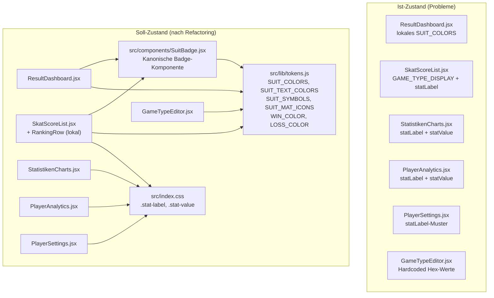

# Design: Inline-Style-Refactoring

## Overview

Das Refactoring konsolidiert duplizierte Inline-Styles und Farbdefinitionen in der Skatastrophe-App,
ohne das visuelle Erscheinungsbild zu verändern. Der Ansatz ist bewusst moderat:

1. **Utility-CSS-Klassen** in `src/index.css` für die zwei häufigsten Typografie-Muster
2. **Eine kanonische `SuitBadge`-Komponente** als einzige Implementierung des Spieltyp-Badges
3. **`RankingRow`-Hilfskomponente** lokal in `SkatScoreList.jsx` für das dreifach duplizierte Ranking-Muster
4. **`tokens.js` als Single Source of Truth** — alle lokalen Farbduplikate werden entfernt
5. **`GameTypeEditor.jsx`** wird ins Design-Token-System integriert

---

## Architecture

### Abhängigkeitsdiagramm (Ist → Soll)



### Datei-Übersicht

| Datei | Änderungstyp | Beschreibung |
|---|---|---|
| `src/components/SuitBadge.jsx` | **Neu** | Kanonische Spieltyp-Badge-Komponente |
| `src/index.css` | **Geändert** | `.stat-label`, `.stat-value` hinzufügen |
| `src/lib/tokens.js` | **Geändert** | `SUIT_SYMBOLS`, `SUIT_MAT_ICONS` ergänzen |
| `src/pages/SkatScoreList.jsx` | **Geändert** | `GAME_TYPE_DISPLAY` entfernen, `RankingRow` extrahieren, `SuitBadge` importieren |
| `src/pages/StatistikenCharts.jsx` | **Geändert** | `statLabel`/`statValue`-Konstanten → CSS-Klassen |
| `src/pages/PlayerAnalytics.jsx` | **Geändert** | `statLabel`/`statValue`-Konstanten → CSS-Klassen |
| `src/pages/PlayerSettings.jsx` | **Geändert** | `statLabel`-Muster → `.stat-label`-Klasse |
| `src/components/scoring/ResultDashboard.jsx` | **Geändert** | Lokales `SUIT_COLORS` entfernen, `SuitBadge` importieren |
| `src/components/GameTypeEditor.jsx` | **Geändert** | Hardcoded Hex-Werte → CSS Custom Properties + `tokens.js` |
| `src/components/SuitBadge.property.test.jsx` | **Neu** | Property-Based Tests für `SuitBadge` |
| `src/lib/tokens.property.test.js` | **Neu** | Property-Based Tests für `tokens.js`-Invarianten |

---

## Components and Interfaces

### 1. `SuitBadge` — Kanonische Spieltyp-Badge-Komponente

**Datei:** `src/components/SuitBadge.jsx`

#### Props

```ts
SuitBadge({
  gameType: string,          // 'club'|'spade'|'heart'|'diamond'|'grand'|'null'|'passed'|unknown
  size?: 'sm' | 'md' | 'lg', // default: 'md'
  className?: string,        // optionale zusätzliche CSS-Klasse
})
```

#### Größen-Varianten

| Size | Breite × Höhe | Icon-Größe | Verwendung |
|---|---|---|---|
| `sm` | 1.25rem × 1.25rem | 0.75rem | `ResultDashboard.jsx` |
| `md` | 2rem × 2rem | 1rem | `SkatScoreList.jsx` |
| `lg` | 2.5rem × 2.5rem | 1.25rem | `GameTypeEditor.jsx` (optional) |

#### Rendering-Logik

```
1. Farben aus tokens.js:
   bg  = SUIT_COLORS[gameType]  ?? 'var(--surface-high)'
   fg  = SUIT_TEXT_COLORS[gameType] ?? 'var(--outline)'

2. Icon-Auswahl:
   - gameType in SUIT_SYMBOLS (club/spade/heart/diamond) → Unicode-Zeichen
   - gameType in SUIT_MAT_ICONS (grand/null/passed)      → <span class="material-symbols-outlined">
   - unbekannter gameType                                 → '?' (Fallback)

3. Ausgabe:
   <span style={{ backgroundColor: bg, width, height, ... }}>
     <span style={{ fontSize: iconSize, color: fg }}>
       {icon}
     </span>
   </span>
```

#### Spieltyp-Symbol-Mapping

| gameType | Symbol | Typ |
|---|---|---|
| `club` | `♣` | Unicode |
| `spade` | `♠` | Unicode |
| `heart` | `♥` | Unicode |
| `diamond` | `♦` | Unicode |
| `grand` | `stars` | Material Symbol |
| `null` | `block` | Material Symbol |
| `passed` | `skip_next` | Material Symbol |
| unbekannt | `?` | Fallback-Text |

#### Designentscheidung: Warum kein `border-radius` als Prop?

Der `border-radius` variiert je nach Verwendungskontext:
- `ResultDashboard`: `0.25rem` (kompakt)
- `SkatScoreList`: `0.4rem` (mittel)

Da beide Werte eng mit der `size`-Prop korrelieren, wird `border-radius` intern aus `size` abgeleitet:
- `sm`: `0.25rem`
- `md`: `0.4rem`
- `lg`: `0.5rem`

---

### 2. `RankingRow` — Lokale Hilfskomponente in `SkatScoreList.jsx`

Bleibt als lokale Komponente in `SkatScoreList.jsx` (kein separates File, da nur dort verwendet).

#### Props

```ts
RankingRow({
  rank: number,   // 1-basierter Rang
  name: string,   // Spielername
  score: number,  // Punktestand (positiv oder negativ)
})
```

#### Rendering-Logik

```
Badge-Hintergrund:
  rank === 1 → 'var(--tertiary-container)'
  rank > 1   → 'var(--surface-high)'

Score-Farbe:
  score >= 0 → 'var(--primary)'
  score < 0  → 'var(--secondary)'

Score-Anzeige:
  score >= 0 → '+{score}'
  score < 0  → '{score}'  (Minus ist bereits im Wert)
```

#### Verwendung (alle drei Ranking-Karten)

```jsx
{rankingData.map((entry) => (
  <RankingRow key={entry.name} rank={entry.rank} name={entry.name} score={entry.score} />
))}
```

---

## Data Models

### `tokens.js` — Ergänzungen

`SUIT_SYMBOLS` und `SUIT_MAT_ICONS` werden in `tokens.js` neu definiert.

**Hinweis:** `SUIT_SYMBOLS` existiert bereits in `src/lib/skatScoring.js` mit leicht abweichenden
Werten (`grand: '★'`, `null: '∅'`, `passed: '⏸'`). Diese Werte sind für die Scoring-Engine
gedacht (Textdarstellung in Tooltips/Labels). Die neuen Konstanten in `tokens.js` sind für
Badge-Rendering optimiert: `grand`, `null` und `passed` verwenden Material Symbols statt Unicode,
da diese im Badge-Kontext besser aussehen.

```js
// Neu in tokens.js:

/** Unicode-Symbole für Farb-Spieltypen (Badge-Rendering) */
export const SUIT_SYMBOLS = {
  club:    '♣',
  spade:   '♠',
  heart:   '♥',
  diamond: '♦',
  // grand, null, passed: kein Unicode — stattdessen Material Symbol (siehe SUIT_MAT_ICONS)
};

/** Material Symbol Icons für nicht-Farb-Spieltypen */
export const SUIT_MAT_ICONS = {
  grand:  'stars',
  null:   'block',
  passed: 'skip_next',
};
```

`WIN_COLOR` und `LOSS_COLOR` sind bereits in `tokens.js` vorhanden (`#2e7d32` und `#d84315`).
Keine Änderung nötig.

---

## CSS-Klassen-Spezifikation

### Neue Utility-Klassen in `src/index.css`

```css
/* ── Refactoring: Utility-Klassen für duplizierte Typografie-Muster ── */

.stat-label {
  font-size: 0.65rem;
  font-weight: 700;
  text-transform: uppercase;
  letter-spacing: 0.1em;
  color: var(--outline);
}

.stat-value {
  font-size: 1.75rem;
  font-weight: 800;
  font-family: 'Manrope', sans-serif;
}
```

### Verwendung in JSX

**Vorher (Inline-Style):**
```jsx
<p style={{ fontSize: '0.65rem', fontWeight: 700, textTransform: 'uppercase',
            letterSpacing: '0.1em', color: 'var(--outline)' }}>
  Runden gesamt
</p>
<p style={{ fontSize: '1.75rem', fontWeight: 800, fontFamily: "'Manrope', sans-serif" }}>
  {rounds.length}
</p>
```

**Nachher (CSS-Klasse):**
```jsx
<p className="stat-label">Runden gesamt</p>
<p className="stat-value">{rounds.length}</p>
```

### Ausnahme: Farbüberschreibungen

Wenn `statValue` mit einer dynamischen Farbe kombiniert wird (z. B. grün/rot je nach Score),
bleibt der Inline-Style für die Farbe erhalten:

```jsx
<p className="stat-value" style={{ color: score >= 0 ? 'var(--primary)' : 'var(--secondary)' }}>
  {score}
</p>
```

Ebenso bei `statLabel` mit abweichender Farbe (z. B. auf farbigem Hintergrund):
```jsx
<p className="stat-label" style={{ color: '#1b1c1c', opacity: 0.65 }}>
  ↑ Spiel
</p>
```

---

## Token-Mapping-Tabelle

### `GameTypeEditor.jsx` — Vollständiges Mapping

| Hardcoded Wert | Kontext | Token / Ersatz |
|---|---|---|
| `#7c3aed` | Aktiver Chip/Button-Hintergrund | `var(--primary)` |
| `#7c3aed` | Aktive Border | `var(--primary)` |
| `#1a1a2e` | Text-Farbe allgemein | `var(--on-surface)` |
| `#555577` | Label-Farbe, sekundärer Text | `var(--outline)` |
| `#c0c0d0` | Border inaktiv | `var(--outline-variant)` |
| `#166534` | Gewonnen-Text | `var(--win-color)` |
| `#991b1b` | Verloren-Text | `var(--loss-color)` |
| `#16a34a` | Gewonnen-Border (aktiv) | `var(--win-color)` |
| `#dc2626` | Verloren-Border (aktiv) | `var(--loss-color)` |
| `#f0fdf4` | Gewonnen-Hintergrund | `color-mix(in srgb, var(--win-color) 10%, transparent)` |
| `#fff1f0` | Verloren-Hintergrund | `color-mix(in srgb, var(--loss-color) 10%, transparent)` |
| `#86efac` | Gewonnen-Border (Vorschau) | `color-mix(in srgb, var(--win-color) 50%, transparent)` |
| `#fca5a5` | Verloren-Border (Vorschau) | `color-mix(in srgb, var(--loss-color) 50%, transparent)` |
| `#ffffff` (dialogStyle bg) | Dialog-Hintergrund | `var(--surface)` |
| `rgba(0, 0, 0, 0.55)` | Overlay-Hintergrund | bleibt als Inline-Style (kein Token) |

### `ResultDashboard.jsx` — Lokales `SUIT_COLORS` entfernen

Das lokale `SUIT_COLORS` in `ResultDashboard.jsx` weicht von `tokens.js` ab:

| Spieltyp | Lokal (falsch) | tokens.js (korrekt) |
|---|---|---|
| `spade` | `#3d4040` | `#414944` |
| `heart` | `#8b1a1a` | `#b52619` |
| `diamond` | `#b5860d` | `#d0a600` |
| `grand` | `#1b4332` | `#0b3d2e` |
| `null` | `#6b7280` | `#717974` |

Nach dem Refactoring verwendet `ResultDashboard.jsx` die `SuitBadge`-Komponente, die intern
`SUIT_COLORS` aus `tokens.js` bezieht. Die Farbabweichungen werden damit korrigiert.

---

## Migrationsreihenfolge

Die Reihenfolge berücksichtigt Abhängigkeiten: Fundament zuerst, Konsumenten danach.

### Schritt 1: Fundament legen (keine Abhängigkeiten)

1. **`src/lib/tokens.js`** — `SUIT_SYMBOLS` und `SUIT_MAT_ICONS` ergänzen
2. **`src/index.css`** — `.stat-label` und `.stat-value` hinzufügen

### Schritt 2: Neue Komponente erstellen

3. **`src/components/SuitBadge.jsx`** — Neue Komponente, importiert aus `tokens.js`

### Schritt 3: Konsumenten migrieren (unabhängig voneinander)

4. **`src/components/scoring/ResultDashboard.jsx`** — Lokales `SUIT_COLORS` entfernen, `SuitBadge` importieren, `statLabel`-Muster → `.stat-label`
5. **`src/pages/SkatScoreList.jsx`** — `GAME_TYPE_DISPLAY` entfernen, `GameTypeIcon` → `SuitBadge`, `RankingRow` extrahieren, `statLabel`-Muster → `.stat-label`
6. **`src/pages/StatistikenCharts.jsx`** — `statLabel`/`statValue`-Konstanten → CSS-Klassen
7. **`src/pages/PlayerAnalytics.jsx`** — `statLabel`/`statValue`-Konstanten → CSS-Klassen
8. **`src/pages/PlayerSettings.jsx`** — `statLabel`-Muster → `.stat-label`

### Schritt 4: GameTypeEditor (isoliert, höchstes Risiko)

9. **`src/components/GameTypeEditor.jsx`** — Alle Hardcoded-Hex-Werte → CSS Custom Properties + `tokens.js`

### Schritt 5: Tests

10. **`src/lib/tokens.property.test.js`** — Property-Tests für `tokens.js`-Invarianten
11. **`src/components/SuitBadge.property.test.jsx`** — Property-Tests für `SuitBadge`

---

## Correctness Properties

*A property is a characteristic or behavior that should hold true across all valid executions of a system — essentially, a formal statement about what the system should do. Properties serve as the bridge between human-readable specifications and machine-verifiable correctness guarantees.*

Die meisten Anforderungen dieses Refactorings sind struktureller Natur (Code-Organisation, Datei-Existenz,
Klassen-Verwendung) und eignen sich nicht für Property-Based Testing. Die folgenden vier Eigenschaften
sind jedoch universell quantifizierbar und profitieren von PBT.

**Property Reflection:** Die Anforderungen 3.2 und 3.3 (Score-Farbe) könnten zu einer einzigen
Eigenschaft kombiniert werden. Da sie jedoch unterschiedliche Farbwerte testen (`var(--primary)` vs.
`var(--secondary)`) und die Grenze bei 0 liegt, bleiben sie als separate Properties erhalten —
sie testen komplementäre Hälften des Zahlenraums. Anforderungen 2.2 und 2.3 (SuitBadge bekannt/unbekannt)
sind ebenfalls komplementär und bleiben getrennt.

### Property 1: SuitBadge — Farbkonsistenz mit tokens.js

*For any* `gameType` in `Object.keys(SUIT_COLORS)`, muss `SuitBadge` als `backgroundColor`
exakt `SUIT_COLORS[gameType]` verwenden.

**Validates: Requirements 2.2, 4.1, 4.5**

### Property 2: SuitBadge — Fallback für unbekannte Spieltypen

*For any* String, der nicht in `Object.keys(SUIT_COLORS)` enthalten ist, muss `SuitBadge`
das Fragezeichen-Fallback rendern und `var(--surface-high)` als Hintergrundfarbe verwenden.

**Validates: Requirements 2.3**

### Property 3: RankingRow — Score-Farb-Invariante

*For any* ganzzahligen Score-Wert `score >= 0` muss `RankingRow` den Score mit `var(--primary)`
darstellen; *for any* `score < 0` muss `var(--secondary)` verwendet werden.

**Validates: Requirements 3.2, 3.3**

### Property 4: tokens.js — Symmetrie zwischen SUIT_COLORS und SUIT_TEXT_COLORS

*For any* Schlüssel in `SUIT_COLORS` muss ein identischer Schlüssel in `SUIT_TEXT_COLORS`
existieren, und umgekehrt. Beide Objekte müssen exakt dieselbe Menge an Schlüsseln haben.

**Validates: Requirements 4.5**

---

## Error Handling

Da dieses Refactoring keine neue Geschäftslogik einführt, sind die Fehlerszenarien begrenzt:

### SuitBadge — Unbekannter gameType

- **Szenario:** `gameType` ist `undefined`, `null`, oder ein unbekannter String
- **Verhalten:** Fallback auf `?`-Symbol, `var(--surface-high)` als Hintergrund, `var(--outline)` als Textfarbe
- **Kein Crash:** Die Komponente wirft keine Exception

### GameTypeEditor — color-mix Browser-Support

- **Szenario:** Älterer Browser ohne `color-mix()`-Support
- **Verhalten:** Transparenter Hintergrund (kein Fallback-Wert nötig, da der Effekt dekorativ ist)
- **Akzeptiert:** `color-mix()` ist seit Chrome 111, Firefox 113, Safari 16.2 unterstützt (Stand 2023)
- **Risiko:** Gering — Skatastrophe ist eine moderne Web-App, ältere Browser sind kein Ziel

### CSS Custom Properties in Inline-Styles

- **Szenario:** CSS Custom Property nicht definiert (z. B. `:root` nicht geladen)
- **Verhalten:** Browser-Default (meist transparent/inherit)
- **Mitigation:** Alle verwendeten Tokens sind in `:root` in `index.css` definiert

---

## Testing Strategy

### Dual Testing Approach

**Unit-Tests (Beispiel-basiert):**
- Spezifische Beispiele für `SuitBadge` (jeder bekannte Spieltyp einmal)
- `RankingRow` mit `rank=1` (Sonderfall: goldener Badge)
- `RankingRow` mit `score=0` (Grenzfall: genau 0 ist positiv)

**Property-Based Tests (fast-check):**
- Universelle Eigenschaften über alle Inputs (siehe Correctness Properties)
- Minimum 100 Iterationen pro Property-Test
- Tag-Format: `// Feature: inline-style-refactoring, Property {N}: {property_text}`

### Testdateien

#### `src/lib/tokens.property.test.js`

```js
// Feature: inline-style-refactoring, Property 4: tokens.js Symmetrie
import { fc } from 'fast-check';
import { SUIT_COLORS, SUIT_TEXT_COLORS } from './tokens';

const KNOWN_TYPES = ['club', 'spade', 'heart', 'diamond', 'grand', 'null', 'passed'];

test('SUIT_COLORS und SUIT_TEXT_COLORS haben identische Schlüssel', () => {
  const colorKeys = Object.keys(SUIT_COLORS).sort();
  const textKeys  = Object.keys(SUIT_TEXT_COLORS).sort();
  expect(colorKeys).toEqual(textKeys);
});

test('Alle bekannten Spieltypen sind in SUIT_COLORS vorhanden', () => {
  KNOWN_TYPES.forEach(type => {
    expect(SUIT_COLORS).toHaveProperty(type);
    expect(SUIT_TEXT_COLORS).toHaveProperty(type);
  });
});
```

#### `src/components/SuitBadge.property.test.jsx`

```jsx
// Feature: inline-style-refactoring, Property 1: SuitBadge Farbkonsistenz
// Feature: inline-style-refactoring, Property 2: SuitBadge Fallback
import { fc } from 'fast-check';
import { render } from '@testing-library/react';
import SuitBadge from './SuitBadge';
import { SUIT_COLORS } from '../lib/tokens';

const KNOWN_TYPES = Object.keys(SUIT_COLORS);

test('Property 1: SuitBadge verwendet SUIT_COLORS für bekannte Spieltypen', () => {
  fc.assert(fc.property(
    fc.constantFrom(...KNOWN_TYPES),
    (gameType) => {
      const { container } = render(<SuitBadge gameType={gameType} />);
      const badge = container.firstChild;
      expect(badge.style.backgroundColor).toBe(SUIT_COLORS[gameType]);
    }
  ), { numRuns: 100 });
});

test('Property 2: SuitBadge zeigt Fallback für unbekannte Spieltypen', () => {
  fc.assert(fc.property(
    fc.string().filter(s => !KNOWN_TYPES.includes(s)),
    (unknownType) => {
      const { container } = render(<SuitBadge gameType={unknownType} />);
      const badge = container.firstChild;
      expect(badge.style.backgroundColor).toBe('var(--surface-high)');
      expect(badge.textContent).toBe('?');
    }
  ), { numRuns: 100 });
});
```

### Bestehende Tests

Alle bestehenden Tests müssen nach dem Refactoring weiterhin bestehen:
- `GameTypeEditor.test.jsx` und `GameTypeEditor.property.test.jsx` — keine inhaltlichen Änderungen
- `ResultDashboard.test.js` — prüft Rendering, nicht Farbwerte; bleibt unverändert
- Alle anderen `*.test.js`-Dateien — nicht betroffen

---

## Risks and Pitfalls

### 1. `color-mix()` Browser-Kompatibilität

**Risiko:** `color-mix(in srgb, var(--win-color) 10%, transparent)` wird in sehr alten Browsern
nicht unterstützt.

**Mitigation:** `color-mix()` ist seit 2023 in allen modernen Browsern verfügbar. Skatastrophe
richtet sich an aktuelle Browser. Falls nötig, kann ein statischer Fallback-Wert als zweite
`background`-Deklaration ergänzt werden.

### 2. Farbabweichungen durch ResultDashboard-Migration

**Risiko:** Das lokale `SUIT_COLORS` in `ResultDashboard.jsx` weicht von `tokens.js` ab (z. B.
`spade: '#3d4040'` vs. `'#414944'`). Die Migration korrigiert diese Abweichungen — das ist
gewollt, aber eine sichtbare Änderung.

**Mitigation:** Die Abweichungen sind minimal (dunkle Farbtöne, kaum wahrnehmbar). Das Ziel
des Refactorings ist explizit Konsistenz. Visuelle Regression-Tests sollten vor dem Merge
durchgeführt werden.

### 3. `SUIT_SYMBOLS`-Namenskonflikt

**Risiko:** `SUIT_SYMBOLS` ist bereits in `src/lib/skatScoring.js` definiert, mit anderen Werten
(`grand: '★'`, `null: '∅'`, `passed: '⏸'`). Das neue `SUIT_SYMBOLS` in `tokens.js` hat andere
Werte für diese drei Typen (kein Unicode, stattdessen `null` für Material-Symbol-Typen).

**Mitigation:** Die beiden Objekte haben unterschiedliche Zwecke:
- `skatScoring.js`: Textdarstellung in Scoring-Kontext (Tooltips, Labels)
- `tokens.js`: Badge-Rendering (nur Farb-Spieltypen haben Unicode-Symbole)

Importpfad macht den Unterschied klar. Komponenten, die Badges rendern, importieren aus `tokens.js`.
Komponenten, die Scoring-Labels rendern, importieren aus `skatScoring.js`.

### 4. `statLabel`-Farbe auf farbigem Hintergrund

**Risiko:** In `StatistikenCharts.jsx` wird `statLabel` auf goldenen/roten Highlight-Kacheln
mit `color: '#1b1c1c'` überschrieben. Die CSS-Klasse `.stat-label` setzt `color: var(--outline)`.

**Mitigation:** Überschreibung per Inline-Style bleibt erhalten:
```jsx
<p className="stat-label" style={{ color: '#1b1c1c', opacity: 0.65 }}>
```
CSS-Spezifität: Inline-Style überschreibt Klasse — kein Problem.

### 5. `marginBottom` in statLabel-Verwendungen

**Risiko:** Einige Verwendungen von `statLabel` haben `marginBottom: '0.25rem'` oder
`marginBottom: '0.75rem'` im Style-Objekt. Die neue `.stat-label`-Klasse definiert kein
`margin-bottom`.

**Mitigation:** `margin-bottom` bleibt als Inline-Style erhalten, wo nötig:
```jsx
<p className="stat-label" style={{ marginBottom: '0.75rem' }}>
```
Das ist korrekt — `margin-bottom` ist kontextabhängig und gehört nicht in eine Utility-Klasse.

### 6. GameTypeEditor — Spieltyp-Buttons mit SUIT_COLORS

**Risiko:** `GameTypeEditor.jsx` rendert Spieltyp-Buttons mit eigenen Farben. Nach dem Refactoring
sollen diese aus `SUIT_COLORS`/`SUIT_TEXT_COLORS` kommen. Die aktuelle Implementierung hat
`heart` und `diamond` mit `color: '#e53935'` für das Icon — das weicht von `SUIT_TEXT_COLORS`
ab.

**Mitigation:** Im aktiven Zustand (`isActive`) wird `SUIT_TEXT_COLORS[key]` verwendet.
Im inaktiven Zustand wird `SUIT_COLORS[key]` als Icon-Farbe verwendet (der Spieltyp-Farbton
als Vorschau). Das ist eine bewusste Designentscheidung, die das visuelle Erscheinungsbild
verbessert und konsistenter macht.
