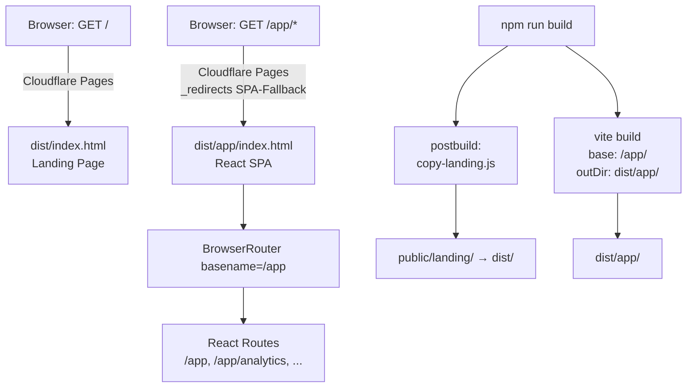

# Design Document - landing-page-routing

## Overview

Dieses Feature verschiebt die React SPA von der Root-URL `/` auf den Pfad `/app` und platziert eine statische Landing Page auf `/`. Die Änderung betrifft den Vite-Build-Basispfad, das clientseitige Routing (React Router), den OAuth-Redirect in AuthGate, ein Post-Build-Script zum Kopieren der Landing-Page-Dateien sowie die Cloudflare-Pages-Routing-Regeln.

Das Ergebnis ist eine klare Trennung: `/` liefert die statische Marketing-Seite aus, `/app` und alle Unterpfade liefern die React SPA.

### Ziel-Verzeichnisstruktur nach Build

```
dist/
  index.html          ← Landing Page (von copy-landing.js kopiert)
  css/
    main.css
    carousel.css
  js/
    carousel.js
  app/
    index.html        ← React SPA Entry (von Vite gebaut)
    assets/
      *.js
      *.css
```

---

## Architecture

Das System besteht aus zwei unabhängig ausgelieferten Teilen, die über Cloudflare Pages Routing koordiniert werden:



### Routing-Entscheidungsbaum

```
Request URL
├── /                    → dist/index.html  (Landing Page, statisch)
├── /app                 → dist/app/index.html  (React SPA)
├── /app/*               → dist/app/index.html  (SPA-Fallback via _redirects)
└── /assets/*, /css/*, /js/*  → statische Dateien (Cloudflare default)
```

---

## Components and Interfaces

### 1. `vite.config.js` - Build-Basispfad

**Änderung:** `base` und `build.outDir` werden gesetzt.

```js
export default defineConfig({
  base: '/app/',
  build: {
    outDir: 'dist/app',
  },
  // ... rest unverändert
})
```

- `base: '/app/'` bewirkt, dass alle generierten Asset-Referenzen in `dist/app/index.html` mit `/app/assets/...` prefixiert werden.
- `outDir: 'dist/app'` schreibt den Vite-Output in das Unterverzeichnis `dist/app/` statt in `dist/`.

### 2. `src/App.jsx` - BrowserRouter basename

**Änderung:** `BrowserRouter` erhält `basename="/app"`.

```jsx
<BrowserRouter basename="/app">
  {/* Routes bleiben unverändert: path="/" → /app/, path="/analytics" → /app/analytics */}
</BrowserRouter>
```

React Router interpretiert alle `path`-Werte relativ zum `basename`. Die internen Route-Definitionen (`/`, `/analytics`, `/history` etc.) bleiben unverändert - React Router hängt den Basename automatisch voran.

### 3. `src/components/AuthGate.jsx` - OAuth-Redirect

**Änderung:** `redirectTo` in `handleGoogle` wird auf `window.location.origin + '/app'` gesetzt.

```js
const { error } = await supabase.auth.signInWithOAuth({
  provider: 'google',
  options: { redirectTo: window.location.origin + '/app' },
});
```

Nach erfolgreichem OAuth-Flow leitet Supabase den Browser auf `https://skatastrophe.de/app` weiter, wo die React SPA läuft und die Auth-Session aufnimmt.

### 4. `scripts/copy-landing.js` - Post-Build-Script

Neues Node.js-Script, das nach dem Vite-Build ausgeführt wird. Es kopiert alle Dateien aus dem Landing-Page-Quellverzeichnis rekursiv in `dist/`.

**Interface:**

```
copyLanding(srcDir: string, destDir: string): void
```

- `srcDir`: Quellverzeichnis (initial `public/landing/`, später `landing/`)
- `destDir`: Zielverzeichnis (`dist/`)
- Wirft einen Fehler mit verständlicher Meldung, wenn `srcDir` nicht existiert
- Überschreibt vorhandene Dateien (inkl. `dist/index.html`, das Vite nicht erzeugt, da `outDir: dist/app`)
- Erhält Unterverzeichnisstruktur (`css/`, `js/`)

**Implementierungsansatz:** `fs.cpSync(src, dest, { recursive: true })` (Node.js ≥ 16.7)

### 5. `package.json` - postbuild-Script

**Änderung:** Neues `postbuild`-Script, das npm automatisch nach `build` ausführt.

```json
"scripts": {
  "build": "vite build",
  "postbuild": "node scripts/copy-landing.js"
}
```

### 6. `public/_redirects` - Cloudflare Pages Routing

**Änderung:** Die bestehende Catch-All-Regel wird durch zwei spezifische Regeln ersetzt.

```
/app/*  /app/index.html  200
```

- Regel 1: Alle Anfragen unter `/app/*` werden auf `/app/index.html` mit Status 200 (SPA-Fallback) weitergeleitet.
- Keine Regel für `/` - Cloudflare Pages liefert `dist/index.html` standardmäßig für die Root-URL aus.
- Keine Catch-All-Regel mehr, die `/` auf die React App routen würde.

### 7. `public/landing/index.html` - CTA-Links

**Änderung:** Alle `href="/"` in CTA-Links werden auf `href="/app"` aktualisiert.

Betroffene Stellen:
- Nav-Link „App starten →": `href="/"` → `href="/app"`
- Hero-CTA „Sabbel nich - Teil aus! ↗": `href="/"` → `href="/app"`
- Finaler CTA „Jetzt kostenlos starten ↗": `href="/"` → `href="/app"`
- Footer-Link „App öffnen": `href="/"` → `href="/app"`

Der Footer-Link `href="/info"` zeigt auf eine Seite innerhalb der React App - dieser wird zu `href="/app/info"` aktualisiert.

### 8. `landing/` - Neuer Top-Level-Ordner

**Änderung:** Die Landing-Page-Quelldateien werden von `public/landing/` nach `landing/` (Root-Ebene) verschoben.

```
landing/
  index.html
  css/
    main.css
    carousel.css
  js/
    carousel.js
```

Das Build-Script wird nach der Migration auf `landing/` als Quellverzeichnis umgestellt. Während der Migration liest es aus `public/landing/`.

### 9. `netlify.toml` - Löschen

Die Datei `netlify.toml` wird gelöscht, da das Deployment auf Cloudflare Pages erfolgt und `netlify.toml` nicht mehr relevant ist.

---

## Data Models

Dieses Feature enthält keine neuen Datenmodelle. Die relevanten Konfigurationswerte sind:

| Konstante | Wert | Verwendung |
|-----------|------|------------|
| `base` (Vite) | `'/app/'` | Asset-Pfad-Prefix im Build |
| `outDir` (Vite) | `'dist/app'` | Build-Ausgabeverzeichnis |
| `basename` (BrowserRouter) | `'/app'` | React Router Basispfad |
| `redirectTo` (AuthGate) | `window.location.origin + '/app'` | OAuth-Redirect-Ziel |
| `LANDING_SRC` (copy-landing.js) | `'public/landing'` → später `'landing'` | Quellverzeichnis des Scripts |
| `LANDING_DEST` (copy-landing.js) | `'dist'` | Zielverzeichnis des Scripts |

---

## Correctness Properties

*A property is a characteristic or behavior that should hold true across all valid executions of a system - essentially, a formal statement about what the system should do. Properties serve as the bridge between human-readable specifications and machine-verifiable correctness guarantees.*

Die meisten Acceptance Criteria dieses Features betreffen statische Konfigurationsdateien (SMOKE) oder externes Infrastrukturverhalten (INTEGRATION). Nur das rekursive Kopier-Script in `copy-landing.js` enthält eigene Logik, die sinnvoll mit Property-Based Testing geprüft werden kann.

### Property 1: Rekursives Kopieren erhält Verzeichnisstruktur

*For any* Verzeichnisbaum mit beliebig verschachtelten Unterverzeichnissen und Dateien, wenn `copyLanding(src, dest)` ausgeführt wird, dann soll jede Datei aus `src` an dem entsprechenden relativen Pfad in `dest` vorhanden sein und denselben Inhalt haben.

**Validates: Requirements 5.1, 5.5**

---

## Error Handling

### copy-landing.js

| Fehlerzustand | Verhalten |
|---------------|-----------|
| `srcDir` existiert nicht | Script bricht mit `Error: Landing-Page-Quellverzeichnis nicht gefunden: <pfad>` ab (Exit-Code ≠ 0) |
| `destDir` existiert nicht | `fs.cpSync` mit `recursive: true` erstellt fehlende Verzeichnisse automatisch |
| Fehlende Schreibrechte | Node.js wirft nativen `EACCES`-Fehler - wird nicht abgefangen, da Build-Umgebung kontrolliert ist |

### AuthGate - OAuth-Fehler

Bestehende Fehlerbehandlung (`if (error) setError(error.message)`) bleibt unverändert. Der `redirectTo`-Wert beeinflusst nur das Redirect-Ziel nach erfolgreichem Login, nicht die Fehlerbehandlung.

### Vite Build

Wenn `outDir: 'dist/app'` gesetzt ist und `dist/app/` bereits existiert, überschreibt Vite den Inhalt. Kein zusätzlicher Fehlerfall.

---

## Testing Strategy

### Übersicht

Die meisten Änderungen dieses Features sind Konfigurationsänderungen (SMOKE) oder testen externes Infrastrukturverhalten (INTEGRATION). Nur `copy-landing.js` enthält testbare eigene Logik.

**PBT ist anwendbar** für die Kopier-Logik in `copy-landing.js` (Property 1). Alle anderen Criteria werden durch Smoke-Tests oder manuelle Integrationstests abgedeckt.

### Unit / Property Tests (`scripts/copy-landing.test.js`)

Bibliothek: **fast-check** (bereits im Projekt vorhanden)

**Property Test - Property 1: Rekursives Kopieren**

```
// Feature: landing-page-routing, Property 1: Rekursives Kopieren erhält Verzeichnisstruktur
fc.assert(fc.property(
  arbitraryFileTree(),   // generiert zufällige Verzeichnisbäume mit Dateien und Unterordnern
  (tree) => {
    // tree in temp src-Verzeichnis schreiben
    // copyLanding(src, dest) ausführen
    // für jede Datei in tree: dest/<relativePath> existiert und hat gleichen Inhalt
  }
), { numRuns: 100 })
```

**Unit Test - Fehlerfall: Quellverzeichnis fehlt**

```js
it('wirft Fehler wenn srcDir nicht existiert', () => {
  expect(() => copyLanding('/nicht/vorhanden', tmpDest))
    .toThrow('Landing-Page-Quellverzeichnis nicht gefunden')
})
```

**Unit Test - index.html wird überschrieben**

```js
it('überschreibt vorhandene dist/index.html', () => {
  // vorhandene index.html in dest anlegen
  // copyLanding ausführen
  // Inhalt entspricht Landing Page, nicht dem vorherigen Inhalt
})
```

### Smoke Tests (manuell / CI-Assertions)

| Criterion | Prüfung |
|-----------|---------|
| 1.4, 1.5 | `public/_redirects` enthält `/app/* /app/index.html 200`, enthält keine Regel für `/` → React App |
| 2.1 | `vite.config.js` hat `base: '/app/'` |
| 3.1 | `src/App.jsx` hat `basename="/app"` auf BrowserRouter |
| 4.1 | `src/components/AuthGate.jsx` hat `redirectTo: window.location.origin + '/app'` |
| 5.2 | `package.json` hat `postbuild`-Script |
| 6.1–6.5 | `public/landing/index.html` enthält keine `href="/"` mehr (außer Anker-Links) |
| 8.1 | `landing/`-Verzeichnis existiert im Repository-Root |

### Integrationstests (nach Deployment)

| Criterion | Prüfung |
|-----------|---------|
| 1.1–1.3 | GET `/`, `/app`, `/app/analytics` liefern jeweils korrekten HTML-Content |
| 2.2–2.3 | `dist/app/index.html` existiert nach Build; Asset-Pfade enthalten `/app/` |
| 3.2–3.3 | Navigation innerhalb der App erzeugt `/app/*`-URLs; Direktaufruf `/app/history` rendert korrekte Route |
| 4.2 | OAuth-Flow leitet nach `/app` weiter |
