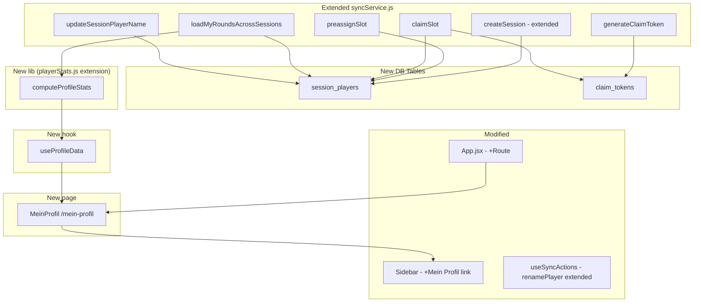
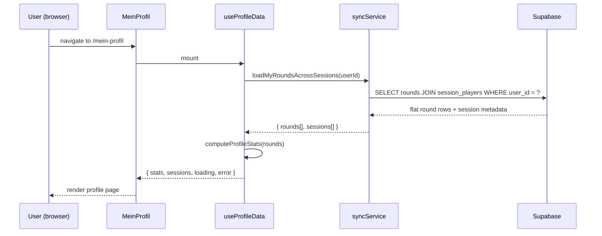
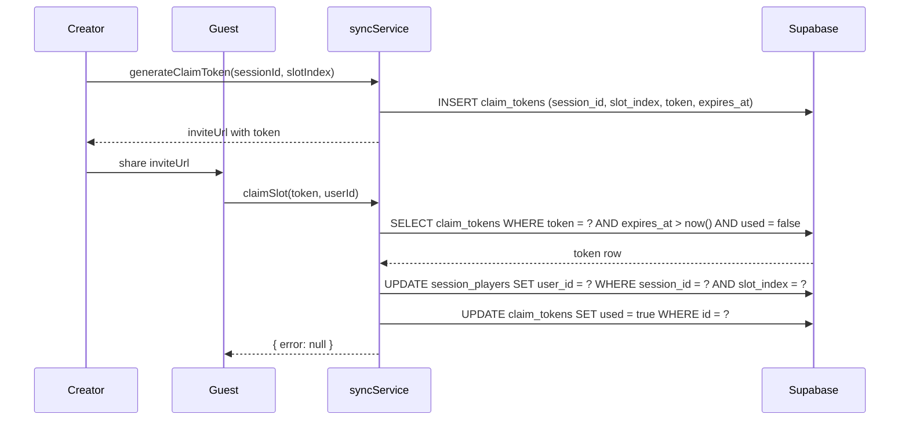

# Design: Spieleridentität und tischübergreifende Statistiken

## Overview

This feature introduces optional player identity to Skatastrophe. Currently every player is identified only by their display name within a single session. This design adds a `session_players` table that optionally links a session slot to a Supabase auth user, enabling a personal profile page at `/mein-profil` that aggregates stats across all tables.

The design is strictly additive: anonymous players are completely unaffected. All new DB columns are nullable, all new code paths are guarded by auth checks, and the existing `syncService.js` / `playerStats.js` / `GameContext` contracts are preserved.

### Key Design Decisions

- **`session_players` as the identity bridge**: Rather than adding a `user_id` column directly to `sessions`, a separate `session_players` table maps each slot (session × slot_index) to an optional `user_id`. This keeps the sessions table clean and allows multiple players per session to have independent identity.
- **Claim tokens in the DB**: Tokens are stored in a `claim_tokens` table rather than signed JWTs, keeping the implementation simple and making revocation trivial (delete the row).
- **`loadMyRoundsAcrossSessions` as a pure DB query**: The cross-table aggregation is a single Supabase query with a join, not a client-side merge. This keeps the data transfer minimal and the logic in one place.
- **`computeProfileStats` as a pure function in `playerStats.js`**: All stat calculations for the profile page are pure functions, consistent with the existing architecture.
- **No changes to `GameContext` or `gameReducer`**: The profile feature is self-contained in its own hook (`useProfileData`) and page (`MeinProfil`). The existing table-scoped context is untouched.

---

## Architecture



### Data Flow: Profile Page



### Data Flow: Slot Claiming



---

## Components and Interfaces

### New DB Tables

#### `session_players`

```sql
CREATE TABLE session_players (
  id           uuid PRIMARY KEY DEFAULT gen_random_uuid(),
  session_id   uuid NOT NULL REFERENCES sessions(id) ON DELETE CASCADE,
  slot_index   integer NOT NULL CHECK (slot_index >= 0 AND slot_index <= 3),
  display_name text NOT NULL,
  user_id      uuid REFERENCES auth.users(id) ON DELETE SET NULL,
  created_at   timestamptz NOT NULL DEFAULT now(),
  UNIQUE (session_id, slot_index),
  UNIQUE (session_id, user_id)   -- one user per session, enforced at DB level
);
```

The `UNIQUE (session_id, user_id)` constraint enforces Requirement 2.2 at the database level. The application layer also validates this before attempting the insert to provide a meaningful error message.

#### `claim_tokens`

```sql
CREATE TABLE claim_tokens (
  id          uuid PRIMARY KEY DEFAULT gen_random_uuid(),
  session_id  uuid NOT NULL REFERENCES sessions(id) ON DELETE CASCADE,
  slot_index  integer NOT NULL,
  token       text NOT NULL UNIQUE,
  expires_at  timestamptz NOT NULL,
  used        boolean NOT NULL DEFAULT false,
  created_by  uuid REFERENCES auth.users(id),
  created_at  timestamptz NOT NULL DEFAULT now()
);
```

### New `syncService.js` Functions

All new functions follow the existing pattern: camelCase parameters in, snake_case DB columns, camelCase return values.

```js
/**
 * Extended createSession: also inserts a session_players row for slot 0.
 * Gracefully degrades if the session_players insert fails (Req 1.4).
 */
export async function createSession(seating, tableName = '')

/**
 * Pre-assigns a slot (index 1–3) to a known user_id (Req 2).
 * Returns { error } where error is null on success.
 */
export async function preassignSlot(sessionId, slotIndex, userId)

/**
 * Generates a claim token for a slot (Req 3.1, 3.7).
 * Only the session creator (slot 0 user_id) may call this.
 * Returns { data: { inviteUrl, token }, error }.
 */
export async function generateClaimToken(sessionId, slotIndex)

/**
 * Claims a slot using a token (Req 3.2–3.6).
 * Returns { error } where error is null on success.
 */
export async function claimSlot(token, userId)

/**
 * Loads all rounds for a user across all sessions (Req 4).
 * Returns { data: Round[], error }.
 * Each Round has an additional sessionId field.
 */
export async function loadMyRoundsAcrossSessions(userId)

/**
 * Updates display_name in session_players without touching user_id (Req 7).
 * Called from the extended renamePlayer action in useSyncActions.
 * Returns { error }.
 */
export async function updateSessionPlayerName(sessionId, oldName, newName)
```

### Extended `useSyncActions.js`

The existing `renamePlayer` action is extended to also call `updateSessionPlayerName` after the existing `renamePlayerInRounds` call:

```js
const renamePlayer = useCallback(async (oldName, newName) => {
  // ... existing logic ...
  const { error: spError } = await syncService.updateSessionPlayerName(sessionId, oldName, newName);
  if (spError) console.error('updateSessionPlayerName fehlgeschlagen:', spError);
}, [state.seating]);
```

### New `playerStats.js` Functions

```js
/**
 * Computes aggregated profile statistics from cross-table rounds.
 * Pure function - no side effects.
 *
 * @param {Round[]} rounds - flat array from loadMyRoundsAcrossSessions
 * @returns {ProfileStats}
 */
export function computeProfileStats(rounds)

/**
 * Groups rounds by sessionId and computes per-session stats.
 * Pure function.
 *
 * @param {Round[]} rounds - flat array from loadMyRoundsAcrossSessions
 * @returns {SessionSummary[]}
 */
export function computePerSessionStats(rounds)
```

### New Hook: `useProfileData`

Location: `src/hooks/useProfileData.js`

```js
/**
 * Loads and computes profile data for the current authenticated user.
 *
 * @returns {{
 *   stats: ProfileStats | null,
 *   sessionSummaries: SessionSummary[],
 *   loading: boolean,
 *   error: string | null,
 *   reload: () => void,
 * }}
 */
export function useProfileData()
```

Internally:
1. Gets `userId` from `supabase.auth.getSession()`
2. Calls `syncService.loadMyRoundsAcrossSessions(userId)`
3. Calls `computeProfileStats(rounds)` and `computePerSessionStats(rounds)`
4. Returns loading/error/data state

### New Page: `MeinProfil`

Location: `src/pages/MeinProfil.jsx`

Route: `/mein-profil` (added to `App.jsx`)

The page uses `useProfileData()` and renders:
- Loading spinner (while `loading === true`)
- Error card with retry button (while `error !== null`)
- Empty state with onboarding hint (when `stats.totalGames === 0`)
- KPI cards: total declarer rounds, total points, win rate
- Per-session collapsible cards
- `GameTypePieChart` (reused from `src/components/analytics/`)
- `LineChart` (Recharts, points over time)

Auth guard: if no user is found in `useProfileData`, redirect to `/` (the AuthGate will handle the login screen). Since the entire app shell is behind `AuthGate`, unauthenticated users never reach this route in practice.

### Modified `Sidebar.jsx`

A single `NavLink` entry is added to the `<nav className="sidebar-nav">` block:

```jsx
<NavLink to="/mein-profil" className={({isActive}) => isActive ? "nav-item active" : "nav-item"}>
  <span className="material-symbols-outlined">person_pin</span>
  Mein Profil
</NavLink>
```

The same entry is added to the mobile bottom nav.

---

## Data Models

### `ProfileStats` (returned by `computeProfileStats`)

```ts
interface ProfileStats {
  totalDeclarerGames: number;   // rounds where user was declarer
  totalPoints: number;          // sum of gameValue across all declarer rounds
  winRate: number;              // percentage, rounded to 1 decimal (e.g. 62.5)
  typeDistribution: Array<{ type: string; count: number; pct: string }>;
  pointsOverTime: Array<{ timestamp: string; cumulativePoints: number }>;
}
```

### `SessionSummary` (returned by `computePerSessionStats`)

```ts
interface SessionSummary {
  sessionId: string;
  tableName: string | null;
  displayName: string;          // the user's display_name in this session
  roundCount: number;           // total rounds the user played as declarer
  winRate: number;              // win rate in this session (1 decimal)
}
```

### Extended `Round` object (from `loadMyRoundsAcrossSessions`)

The existing `Round` shape from `loadSession` is preserved. Two fields are added:

```ts
interface CrossTableRound extends Round {
  sessionId: string;    // which session this round belongs to
  playerName: string;   // display_name from session_players (may differ from round.player after rename)
}
```

### `session_players` row (camelCase app representation)

```ts
interface SessionPlayer {
  id: string;
  sessionId: string;
  slotIndex: number;
  displayName: string;
  userId: string | null;
  createdAt: string;
}
```

### `claim_tokens` row (camelCase app representation)

```ts
interface ClaimToken {
  id: string;
  sessionId: string;
  slotIndex: number;
  token: string;
  expiresAt: string;   // ISO 8601
  used: boolean;
  createdBy: string | null;
  createdAt: string;
}
```

---

## Correctness Properties

*A property is a characteristic or behavior that should hold true across all valid executions of a system — essentially, a formal statement about what the system should do. Properties serve as the bridge between human-readable specifications and machine-verifiable correctness guarantees.*

### Property 1: Session creator slot always gets the correct user_id

*For any* authenticated user creating a session with any valid seating array, the resulting `session_players` row at `slot_index = 0` SHALL have `user_id` equal to the creator's user ID and `display_name` equal to `seating[0]`.

**Validates: Requirements 1.1, 1.3**

---

### Property 2: Slot user_id uniqueness within a session

*For any* session and any attempt to assign a `user_id` that is already assigned to another slot in that session, the operation SHALL be rejected and all existing slot assignments SHALL remain unchanged.

**Validates: Requirements 2.2, 2.4**

---

### Property 3: Empty/null user_id is always rejected for preassign

*For any* value that is null, the empty string, or composed entirely of whitespace, attempting to preassign it as a slot's `user_id` SHALL be rejected with a validation error.

**Validates: Requirement 2.6**

---

### Property 4: Claim token encodes correct session and slot

*For any* session ID and slot index (0–3), a generated claim token SHALL decode to exactly that session ID and slot index, and its `expires_at` SHALL be within ±60 seconds of 72 hours from the time of generation.

**Validates: Requirement 3.1**

---

### Property 5: Claim succeeds only when all preconditions hold simultaneously

*For any* combination of token state (expired / not expired), usage state (used / unused), slot state (already claimed / unclaimed), and caller identity (creator / non-creator), a claim operation SHALL succeed if and only if: the token is not expired, the token has not been used, the slot has no existing `user_id`, and the caller is not the session creator.

**Validates: Requirements 3.2, 3.3, 3.4**

---

### Property 6: Successful claim invalidates the token

*For any* valid, unused, unexpired claim token, after a successful `claimSlot` call, any subsequent `claimSlot` call with the same token SHALL be rejected.

**Validates: Requirement 3.6**

---

### Property 7: Only the session creator can generate claim tokens

*For any* session and any user who is not the creator (i.e., not the `user_id` at `slot_index = 0`), attempting to generate a claim token SHALL be rejected with an authorization error.

**Validates: Requirement 3.7**

---

### Property 8: Cross-table load returns all rounds from all linked sessions

*For any* user ID and any set of sessions where at least one slot is linked to that user ID, `loadMyRoundsAcrossSessions` SHALL return a flat array containing every round from every linked session, with no rounds omitted and no rounds from unlinked sessions included.

**Validates: Requirements 4.1, 4.3**

---

### Property 9: Cross-table rounds carry correct playerName and sessionId

*For any* round returned by `loadMyRoundsAcrossSessions`, the `playerName` field SHALL equal the `display_name` of the `session_players` row that links the user to that session, and the `sessionId` field SHALL equal the session the round belongs to.

**Validates: Requirements 4.2, 4.3**

---

### Property 10: Profile stats win rate is correctly computed

*For any* non-empty array of declarer rounds, `computeProfileStats` SHALL return a `winRate` equal to `(wins / totalDeclarerGames * 100)` rounded to one decimal place, and `totalPoints` equal to the sum of all `gameValue` fields.

**Validates: Requirement 5.2**

---

### Property 11: Rename preserves user_id in session_players

*For any* rename operation (any old name, any new name), the `user_id` in the `session_players` row for the renamed slot SHALL be identical before and after the rename.

**Validates: Requirement 7.2**

---

### Property 12: Rounds recorded under old names are still returned after rename

*For any* sequence of rounds recorded under a player's old display name, followed by a rename, `loadMyRoundsAcrossSessions` SHALL still return all rounds recorded under the old name, because the slot's `user_id` link is preserved.

**Validates: Requirements 7.3, 7.4**

---

### Property 13: Anonymous sessions load without errors

*For any* session where all `session_players` rows have `user_id = null`, loading that session SHALL succeed and return all rounds without any validation errors or missing data.

**Validates: Requirements 8.1, 8.2**

---

## Error Handling

### `createSession` with `session_players` insert failure (Req 1.4)

The `session_players` insert is wrapped in a try/catch after the `sessions` insert succeeds. If it fails, the error is logged to the console and the function returns the successfully created session. The table is usable without a profile link.

```js
// Pseudocode
const { data: session, error } = await supabase.from('sessions').insert(...).select().single();
if (error) return { data: null, error };

try {
  await supabase.from('session_players').insert({ session_id: session.id, slot_index: 0, display_name: seating[0], user_id });
} catch (spError) {
  console.error('session_players insert failed (non-fatal):', spError);
}
return { data: session, error: null };
```

### `preassignSlot` duplicate user_id (Req 2.2–2.5)

Before inserting, the service checks for an existing `session_players` row with the same `user_id` in the session. If found, it returns `{ error: { message: 'Diese user_id ist in dieser Session bereits vergeben.' } }` without touching the DB. The DB-level `UNIQUE (session_id, user_id)` constraint acts as a safety net.

### `claimSlot` validation chain (Req 3.2–3.6)

Each precondition is checked in sequence, returning a specific error message on failure:
1. Token not found → `'Ungültiger Einladungslink.'`
2. Token expired → `'Dieser Einladungslink ist abgelaufen.'`
3. Token already used → `'Dieser Einladungslink wurde bereits verwendet.'`
4. Slot already claimed → `'Dieser Slot ist bereits vergeben.'`
5. Caller is session creator → `'Du bist bereits der Tischersteller.'`

### `loadMyRoundsAcrossSessions` network failure (Req 4.5)

Any Supabase error causes the function to return a rejected promise (re-throw). No partial data is returned. The `useProfileData` hook catches this and sets `error` state, which the `MeinProfil` page renders as an error card with a retry button.

### `updateSessionPlayerName` failure (Req 7.5)

Returns `{ error }` to the caller. The `renamePlayer` action in `useSyncActions` logs the error but does not roll back the already-completed `renamePlayerInRounds` call. The display_name in `session_players` remains at its previous value; the rounds table has been updated. This is an acceptable inconsistency since the profile will still load all rounds (the slot's `user_id` is intact), and the display_name mismatch will be visible to the user as a discrepancy between the table name and the profile name.

---

## Testing Strategy

### Unit Tests (example-based)

Located next to the source file they test (`*.test.js`).

**`syncService.test.js`** (new tests, Supabase mocked via `vi.mock`):
- `createSession` with authenticated user creates `session_players` row at slot 0
- `createSession` with unauthenticated user creates `session_players` row with `user_id = null`
- `createSession` gracefully handles `session_players` insert failure
- `preassignSlot` rejects null/empty `user_id`
- `claimSlot` rejects expired token
- `claimSlot` rejects already-used token
- `claimSlot` rejects when slot already claimed
- `loadMyRoundsAcrossSessions` returns empty array when no linked sessions
- `loadMyRoundsAcrossSessions` rejects on network error

**`playerStats.test.js`** (new tests):
- `computeProfileStats` returns `winRate = "0.0"` when no declarer rounds
- `computeProfileStats` returns correct values for a known input
- `computePerSessionStats` groups rounds by sessionId correctly

**`MeinProfil.test.jsx`** (component tests, `@testing-library/react`):
- Renders loading state
- Renders empty state with hint text
- Renders error state with retry button
- Renders KPI cards when data is loaded
- Redirects when no user is authenticated

### Property-Based Tests (fast-check)

Located in `*.property.test.js` files next to the source.

**`syncService.property.test.js`**:
- Property 1: Session creator slot user_id and display_name
- Property 2: Slot user_id uniqueness (rejection + state preservation)
- Property 3: Empty/null user_id always rejected
- Property 4: Claim token encodes correct session and slot
- Property 5: Claim preconditions conjunction
- Property 6: Successful claim invalidates token
- Property 7: Only creator can generate tokens
- Property 8: Cross-table load completeness
- Property 9: Cross-table rounds carry correct playerName and sessionId
- Property 11: Rename preserves user_id
- Property 12: Old-name rounds still returned after rename
- Property 13: Anonymous sessions load without errors

**`playerStats.property.test.js`** (new tests added to existing file):
- Property 10: Win rate and total points computation

Each property test runs a minimum of 100 iterations via fast-check's `fc.assert(fc.property(...))`.

Tag format in test comments:
```js
// Feature: player-identity-cross-table-stats, Property 1: Session creator slot always gets the correct user_id
```

### Integration Tests

Not automated. Manual verification steps for the Supabase-dependent flows:
- Creating a session as an authenticated user and verifying the `session_players` row in the Supabase dashboard
- Generating and using an invite link end-to-end
- Verifying RLS policies allow authenticated users to read their own `session_players` rows

### DB Migration

A new migration file `supabase/migrations/008_player_identity.sql` creates:
- `session_players` table with RLS policies
- `claim_tokens` table with RLS policies
- Indexes on `session_players(session_id)`, `session_players(user_id)`, `claim_tokens(token)`, `claim_tokens(session_id)`

RLS policies:
- `session_players`: authenticated users can read all rows; can insert/update only rows where `user_id = auth.uid()` or where the session's creator slot (`slot_index = 0`) has `user_id = auth.uid()`
- `claim_tokens`: authenticated users can read tokens for sessions they created; can update (mark used) tokens targeting their own user_id
