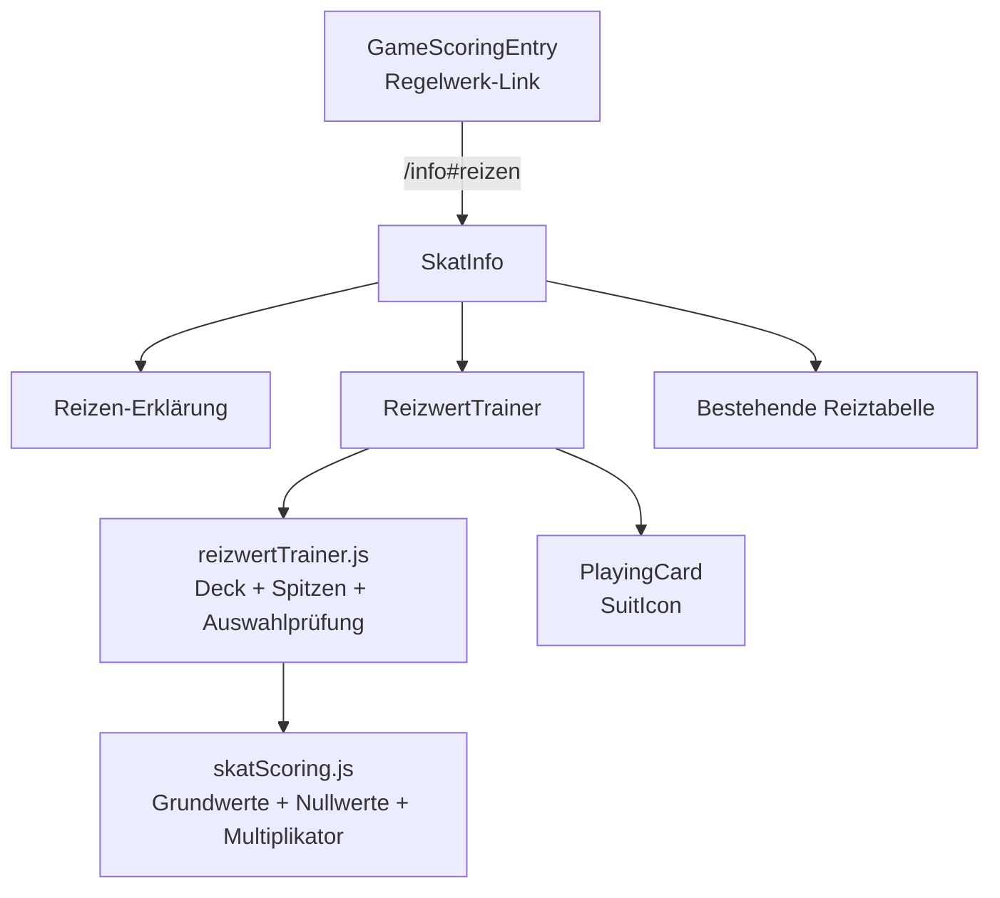

# Design Document: Reizwert-Trainer

## Overview

Der Reizwert-Trainer ergänzt die bestehende Regelwerk-Seite um eine kurze, spielerische Lernübung. Der Nutzer erhält ein zufällig erzeugtes 10-Karten-Blatt, wählt eine Spielart und bestimmt die dazugehörige Ansage. Danach gibt er den Reizwert dieser konkreten Auswahl ein und erhält eine getrennte Rückmeldung zu Spielwert und Spitzen.

Die zentrale Produktentscheidung ist der **Auswahlmodus**:

- zehn Karten aus einem deutschen 32-Karten-Deck
- Farbspiele, Grand und Null
- Auswahl von Spielart, Mit/Ohne und Spitzen, soweit anwendbar
- Spielwertprüfung für die ausgewählte Kombination
- keine globale Maximalwertsuche
- **Bewusster Spitzenumfang**: Im Trainer werden ausschließlich 1 bis 4 Spitzen bewertet. Die offizielle Rohberechnung höherer Spitzen bleibt in der Fachlogik erhalten, ist aber nicht Teil dieses vereinfachten Trainers.
- kein taktischer Reizvorschlag
- kein Skat, Hand, Schneider, Schwarz, Ouvert, Bock oder Seeger-Fabian
- keine Persistenz und kein Datenbankzugriff

Null ist im Auswahlmodus bewusst enthalten und verwendet den festen zentralen Wert 23. Für Null gibt es keine Spitzen.

## Key Design Decisions

- **Einbettung statt neue Route**: Der Trainer wird in `SkatInfo` zwischen der Reiz-Erklärung und der Reiztabelle gerendert.
- **Pure Fachlogik**: Deck, Trumpfreihenfolge, Spitzenberechnung, Spielwert und Auswahlprüfung liegen in `src/lib/reizwertTrainer.js` ohne React oder Seiteneffekte.
- **Wiederverwendung bestehender Werte**: `BASE_VALUES`, `NULL_VALUES` und `calculateMultiplier` aus `src/lib/skatScoring.js` bleiben die zentrale Quelle.
- **Deterministische Testbarkeit**: Der Puzzle-Generator akzeptiert optional eine Zufallsfunktion.
- **Auswahl als Antwortvertrag**: Der Nutzer darf eine unterstützte Spielart auswählen. Die Prüfung bewertet die Ansage für diese Spielart und den Reizwert der eingegebenen Spitzenzahl. Andere mögliche Spielarten werden nicht verglichen.
- **Korrekturmodus**: Falsche Antworten bleiben bearbeitbar. Eine vollständig richtige Aufgabe wird bis „Neue Aufgabe“ gesperrt.
- **Lokaler Aufgabenstatus**: Auswahl, Eingabe, Feedback und Sperrstatus leben ausschließlich im React-State.
- **Iconset-Kompatibilität**: Kartenfarben werden mit `SuitIcon` beziehungsweise einer darauf aufbauenden Kartenkomponente dargestellt.

## Architecture



### Component Hierarchy

```text
SkatInfo
  ├─ Reizen-Erklärung
  ├─ ReizwertTrainer
  │    ├─ TrainerHeader
  │    ├─ HandDisplay
  │    │    └─ PlayingCard × 10
  │    ├─ SelectionForm
  │    └─ Feedback
  └─ Reiztabelle
```

`PlayingCard` bleibt eine eigene wiederverwendbare Komponente. Die Trainer-Unterbereiche dürfen zunächst lokal in `ReizwertTrainer.jsx` bleiben.

### Seitenintegration

`src/pages/SkatInfo.jsx` enthält:

1. eine Sektion `id="reizen"` mit der statischen Erklärung des Ablaufs,
2. eine Sektion `id="reizen-uebung"` mit `<ReizwertTrainer />`.

Die Reihenfolge lautet:

```text
So funktioniert Skatastrophe
Was ist Skat?
Reizen verstehen                    #reizen
Reizwert-Trainer                    #reizen-uebung
Reiztabelle
```

Der bestehende Link in `src/pages/GameScoringEntry.jsx` zeigt auf `/info#reizen`. Die Navigation bleibt unverändert; auf Mobile wird kein zusätzlicher Eintrag eingeführt.

## Pure Logic API

**Datei:** `src/lib/reizwertTrainer.js`

### Constants

```javascript
export const DECK_RANKS = [
  'seven', 'eight', 'nine', 'ten',
  'jack', 'queen', 'king', 'ace',
];

export const DECK_SUITS = ['club', 'spade', 'heart', 'diamond'];

export const COLOR_TRUMP_ORDER = {
  club:    ['club-jack', 'spade-jack', 'heart-jack', 'diamond-jack', 'club-ace', 'club-ten', 'club-king', 'club-queen', 'club-nine', 'club-eight', 'club-seven'],
  spade:   ['club-jack', 'spade-jack', 'heart-jack', 'diamond-jack', 'spade-ace', 'spade-ten', 'spade-king', 'spade-queen', 'spade-nine', 'spade-eight', 'spade-seven'],
  heart:   ['club-jack', 'spade-jack', 'heart-jack', 'diamond-jack', 'heart-ace', 'heart-ten', 'heart-king', 'heart-queen', 'heart-nine', 'heart-eight', 'heart-seven'],
  diamond: ['club-jack', 'spade-jack', 'heart-jack', 'diamond-jack', 'diamond-ace', 'diamond-ten', 'diamond-king', 'diamond-queen', 'diamond-nine', 'diamond-eight', 'diamond-seven'],
};

export const GRAND_TRUMP_ORDER = [
  'club-jack', 'spade-jack', 'heart-jack', 'diamond-jack',
];
```

### Card shape

```javascript
{
  id: 'club-jack',
  rank: 'jack',
  rankLabel: 'Bube',
  suit: 'club',
  suitLabel: 'Kreuz'
}
```

### `createDeck` und `drawHand`

```javascript
createDeck() -> Card[]
drawHand(random = Math.random) -> Card[]
```

`createDeck` erzeugt jede Kombination aus acht Rängen und vier Farben genau einmal. `drawHand` mischt eine frische Kopie und gibt genau zehn unterschiedliche Karten zurück. Die Zufallsfunktion ist ausschließlich eine Testbarkeits- und Reproduzierbarkeitsschnittstelle.

### `getSpitzen`

```javascript
getSpitzen(hand, trumpOrder) -> {
  mitOhne: 'mit' | 'ohne',
  spitzen: number,
}
```

Ist der erste Trumpf vorhanden, wird die zusammenhängende vorhandene Präfixfolge als `mit` gezählt. Fehlt er, wird die zusammenhängende fehlende Präfixfolge als `ohne` gezählt. Die Rohfunktion kennt bei Farbspielen weiterhin die vollständige elfteilige Reihenfolge und kann daher auch offizielle Werte über 4 liefern; diese Werte werden weder gekappt noch als Trainerantwort bewertet. Für den Trainer werden nur Hände verwendet, deren tatsächliche Spitzenzahl bei jedem Farbspiel höchstens 4 und bei Grand höchstens 4 beträgt.

### `createTrainerPuzzle`

```javascript
createTrainerPuzzle({ random = Math.random } = {}) -> {
  hand: Card[],
}
```

Der Generator zieht wiederholt eine frische Zehnerhand und verwirft sie, sobald die offizielle Spitzenberechnung für eines der vier Farbspiele über 4 liegt. Nach einer begrenzten Zahl von Versuchen wird bei einer pathologischen Zufallsquelle ein beschreibender Fehler ausgelöst, statt endlos zu laufen. Das Puzzleobjekt enthält weiterhin bewusst nur die zehn Karten. Erwartete Ansage und Spielwert werden erst für die vom Nutzer gewählte Spielart berechnet. Dadurch wird keine Lösung in einem UI-nahe gereichten Puzzleobjekt vorab gerendert und es gibt keine zweite Maximalwert-API.

### Auswahltypen und Spielwert

Unterstützte Spielarten sind `club`, `spade`, `heart`, `diamond`, `grand` und `null`.

Für Farbspiele und Grand gilt:

```javascript
const value = BASE_VALUES[gameType] * calculateMultiplier(spitzen, {});
```

Für Null gilt:

```javascript
const value = NULL_VALUES.null;
```

### `getSpitzenForGame`

```javascript
getSpitzenForGame(hand, gameType) -> {
  mitOhne: 'mit' | 'ohne',
  spitzen: number,
} | null
```

Für Null wird `null` zurückgegeben, da Null keine Trümpfe und damit keine Spitzen hat.

### `evaluateSelection`

```javascript
evaluateSelection(selection, puzzle) -> {
  status: 'correct' | 'incorrect',
  gameType: string,
  submitted: object,
  expected: object | null,
  expectedGameValue: number,
  calculatedGameValue: number,
  gameValueCorrect: boolean,
  spitzenCorrect: boolean | null,
}
```

Die Funktion:

1. validiert Auswahl, Zahl und Kartenhand,
2. berechnet die erwartete Ansage für den gewählten Spieltyp,
3. berechnet den Spielwert der eingegebenen Spitzenzahl,
4. vergleicht Reizwert und Ansage getrennt,
5. liefert den erwarteten Reizwert für das Feedback zurück.

Es wird absichtlich kein Vergleich mit anderen Spielarten durchgeführt.

## UI Design

### Trainer-Karte

```text
ÜBUNG
Reizwert-Trainer
Auswahlmodus · 10 Karten · Farbspiele, Grand und Null
Nur 1 bis 4 Spitzen; höhere, eigentlich korrekt berechenbare Spitzen bleiben bewusst außerhalb des Trainers
Keine Sonderstufen und keine taktische Reizempfehlung

[ 10 Karten ]

Welche Spielart, Ansage und welcher Reizwert passen zu diesem Blatt?
[ Spielart ] [ Mit/Ohne ] [ Spitzen ] [ Reizwert ] [ Prüfen ]
```

Die Aufgabenstellung erklärt, dass die gewählte Kombination geprüft wird. Bei Null wird die Spitzenauswahl deaktiviert.

### Kartenanzeige

`PlayingCard` rendert Rang, `SuitIcon`, sichtbare Farbbezeichnung und einen zugänglichen Namen wie „Kreuz-Bube“. Die Karten werden stabil nach Farbe und Rang sortiert und auf kleinen Viewports ohne zwingendes horizontales Scrollen dargestellt.

### Eingabe und Status

- Das Reizwertfeld verwendet `type="number"`, eine sichtbare deutsche Beschriftung und mobile Eingabehilfe.
- Spielart, Mit/Ohne und Spitzen werden über tastatur- und touch-fähige Buttons gewählt.
- Leere oder ungültige Eingaben werden inline validiert.
- Nach einer falschen Prüfung bleiben die Eingaben bearbeitbar.
- Nach einer richtigen Prüfung werden die Auswahl und das Reizwertfeld bis „Neue Aufgabe“ deaktiviert.
- Der Feedbackbereich erhält `role="status"` und `aria-live="polite"`.
- Richtig/Falsch wird mit Text und Symbol gekennzeichnet.

### Feedback

Das Feedback trennt:

```text
Spielwert: ✓/✗
Spitzen: ✓/✗
```

Bei einer falschen Prüfung kann die richtige Lösung über „Richtige Lösung anzeigen“ eingeblendet werden. Bei einer richtigen Prüfung wird sie direkt angezeigt. Für Null wird ausdrücklich „Beim Nullspiel gibt es keine Spitzen“ angezeigt.

### Aufgabenstatus

Die Komponente hält nur den aktuellen lokalen Aufgabenstatus:

```javascript
{
  puzzle,
  gameType,
  mitOhne,
  spitzen,
  reizwert,
  validationError,
  status,
  evaluation,
  showSolution,
  hasSubmitted,
}
```

„Neue Aufgabe“ erzeugt ein neues Blatt und setzt Auswahl, Eingabe und Feedback zurück. Es gibt keine Runde-, Treffer- oder Serienstatistik.

## Data Models

### Selection

```typescript
interface Selection {
  gameType: 'club' | 'spade' | 'heart' | 'diamond' | 'grand' | 'null';
  mitOhne: 'mit' | 'ohne';
  spitzen: number | null;
  reizwert: number;
}
```

Bei Null werden `spitzen` und die Spitzenprüfung nicht angewendet.

### Puzzle

```typescript
interface Puzzle {
  hand: Card[]; // exakt 10 eindeutige Karten
}
```

### Keine Persistenz

Es werden keine neuen Supabase-Spalten, Migrationen, SyncService-Felder, Context-Felder oder localStorage-Schlüssel benötigt.

## Correctness Properties

### Property 1: Jede Aufgabe enthält zehn eindeutige Karten

*For any* zulässige Zufallsquelle liefert `createTrainerPuzzle()` eine Hand der Länge 10, deren Karten-IDs eindeutig und im 32-Karten-Deck enthalten sind und deren tatsächliche Spitzenzahl bei jedem Farbspiel höchstens 4 beträgt.

**Validates: Requirements 3.1, 3.2, 3.3**

### Property 2: Spitzenberechnung folgt der Trumpfreihenfolge

*For any* Hand und gültige Trumpfreihenfolge zählt `getSpitzen` die zusammenhängende vorhandene oder fehlende Präfixfolge als `mit` beziehungsweise `ohne`.

**Validates: Requirements 4.1, 4.2, 4.3, 4.4**

### Property 3: Auswahlwerte verwenden die zentrale Formel

*For any* unterstützte Farbspiel- oder Grand-Auswahl mit 1 bis 4 Spitzen gilt `calculateTrainerGameValue(gameType, spitzen) === BASE_VALUES[gameType] * (spitzen + 1)`. Spitzenwerte über 4 werden als ungültige Trainer-Auswahl abgewiesen. Für Null gilt der zentrale feste Wert 23.

**Validates: Requirements 4.5, 4.6, 4.7**

### Property 4: Die erwartete Ansage wird für den gewählten Spieltyp korrekt geprüft

*For any* erzeugtes Puzzle und unterstützte Nicht-Null-Spielart liefert eine Auswahl mit der von `getSpitzenForGame` berechneten Ansage sowie dem dazu passenden Reizwert den Status `correct`. Die Rohfunktion `getSpitzenForGame` darf dabei weiterhin Werte über 4 liefern; der Generator stellt sicher, dass dies bei seinen Puzzles nicht vorkommt.

**Validates: Requirements 4.1–4.7, 6.3**

### Property 5: Spielwert und Ansage werden getrennt bewertet

*For any* gültige Auswahl kann das Ergebnis unterscheiden, ob der Reizwert oder die Mit/Ohne-/Spitzen-Auswahl falsch ist.

**Validates: Requirements 6.3, 7.2**

### Property 6: Null hat keine Spitzen

*For any* gültige Kartenhand liefert `getSpitzenForGame(hand, 'null')` `null`, und der Reizwert 23 ist die korrekte Null-Auswahl.

**Validates: Requirements 2.4, 4.7, 7.4**

## Error Handling

### Ungültige Nutzereingabe

- Keine Prüfung ausführen.
- Eine verständliche deutsche Meldung anzeigen.
- Auswahl und Eingabe bis zur Korrektur bearbeitbar lassen.
- Keine Aufgabe als richtig markieren.

### Fehler bei der Puzzle-Erzeugung

Der Generator wirft bei ungültiger Zufallsquelle einen beschreibenden Fehler. Er verwirft Hände mit tatsächlichen Spitzen über 4 für mindestens ein Farbspiel und liefert nach einer begrenzten Zahl erfolgloser Versuche einen beschreibenden Fehler, statt endlos zu laufen. Der reguläre Generator liefert ansonsten zehn eindeutige Karten aus dem lokalen Deck.

### Unbekannter Spieltyp oder ungültige Auswahl

Die pure Funktion wirft einen beschreibenden Fehler beziehungsweise eine `RangeError`/`TypeError`. Die UI verhindert die normalen ungültigen Kombinationen durch deaktivierte Auswahlfelder und Validierung.

### Keine Netzwerk- oder Persistenzfehler

Der MVP verwendet keine externen Datenquellen und speichert keine Übungsergebnisse. Supabase-, Sync- und localStorage-Fehler können daher nicht durch den Trainer entstehen.

## Testing Strategy

### Unit Tests

- Deck enthält 32 eindeutige Karten.
- Eine Aufgabe enthält exakt zehn eindeutige Karten.
- `mit`- und `ohne`-Beispiele funktionieren.
- Farbspiel- und Grand-Trumpfreihenfolgen sind korrekt.
- Spielwerte verwenden Grundwerte und zentrale Multiplikatorlogik; 1 bis 4 sind die einzigen zulässigen Trainer-Spitzenwerte, während die offizielle Rohberechnung höherer Spitzen separat erhalten bleibt.
- Ausgewählte Ansage und Reizwert werden getrennt bewertet.
- Ein Puzzle mit tatsächlichen Spitzen über 4 wird als außerhalb des vereinfachten Trainerbereichs abgewiesen.
- Null liefert festen Wert 23 und keine Spitzen.
- Ungültige Zufallsquellen, Kartenhände, Spielarten und Eingaben werden abgewiesen.

### Property-Based Tests

Bibliothek: **fast-check**.

Konfiguration: Mindestens 100 Iterationen pro Property-Test. Jeder Property-Test wird mit einem Kommentar annotiert:

```javascript
// Feature: reizwert-trainer, Property N: <property_text>
```

Die sechs Properties aus diesem Design werden auf Deck, Spitzen, Spielwerte und Auswahlprüfung angewendet.

### Component Tests

- Trainer rendert zehn Karten und den Auswahlmodus-Hinweis.
- Fehlende Auswahl und leere/ungültige Reizwerte zeigen Validierung.
- Richtige Auswahl zeigt positives Feedback und sperrt die aktuelle Aufgabe.
- Falsche Auswahl zeigt getrenntes Feedback und bleibt korrigierbar.
- Null deaktiviert Spitzen und zeigt den Hinweis ohne Spitzen.
- „Neue Aufgabe“ setzt Eingabe und Feedback zurück.
- Reizen-Erklärung, Trainer und Reiztabelle erscheinen in der vorgesehenen Reihenfolge.

## Out of Scope

- globalen Maximalwert aus allen Spielarten ermitteln
- mehrere gleichwertige Spielarten vergleichen
- taktische Reizempfehlungen
- Gewinnwahrscheinlichkeit oder Kartenverteilung der Gegenspieler
- unbekannter oder aufgenommener Skat
- Handspiele und Ergebnisstufen
- Bock, Seeger-Fabian und persistente Lernstatistik
- Runde-, Treffer- oder Serienanzeige
