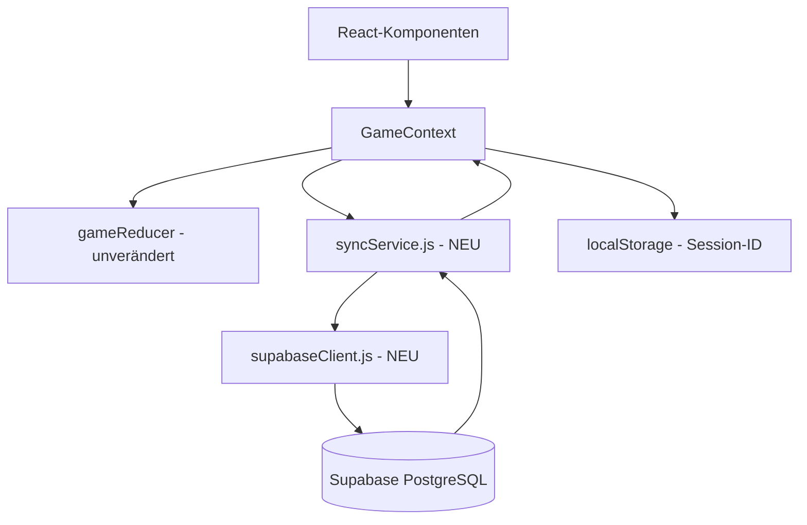
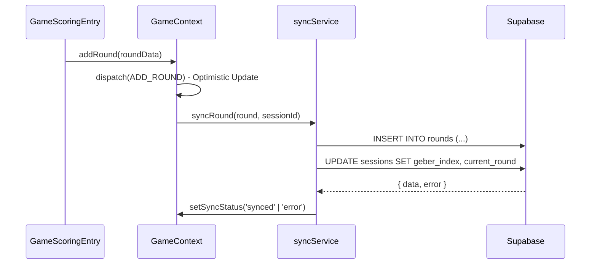
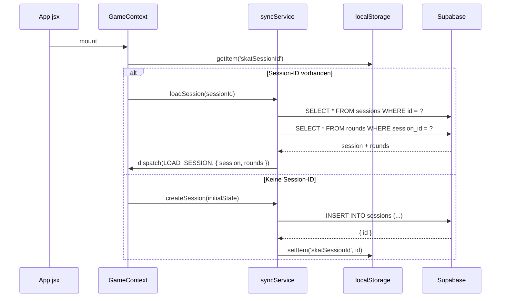

# Design-Dokument: Supabase-Persistenz-Integration

## Übersicht

Die Integration fügt der bestehenden React/Vite Skat-Scoring-App eine Persistenzschicht über Supabase (PostgreSQL) hinzu. Der Ansatz ist bewusst minimal-invasiv: Der bestehende `GameContext` und `gameReducer` bleiben unverändert. Ein neuer `Sync_Service` (`src/lib/syncService.js`) kapselt alle Datenbankoperationen und wird als dünne Schicht über den bestehenden `dispatch`-Aufrufen eingehängt.

Da niemals zwei Geräte gleichzeitig aktiv schreiben, wird auf Echtzeit-Synchronisation verzichtet. Stattdessen gibt es einen manuellen Refresh-Button in der Sidebar.

---

## Architektur



### Datenfluss beim Hinzufügen einer Runde



### Datenfluss beim App-Start



---

## Komponenten und Schnittstellen

### `src/lib/supabaseClient.js` (NEU)

Singleton-Instanz des Supabase-Clients.

```js
import { createClient } from '@supabase/supabase-js'

const supabaseUrl = import.meta.env.VITE_SUPABASE_URL
const supabaseAnonKey = import.meta.env.VITE_SUPABASE_ANON_KEY

export const supabase = createClient(supabaseUrl, supabaseAnonKey)
```

### `src/lib/syncService.js` (NEU)

Kapselt alle Datenbankoperationen. Gibt immer `{ data, error }` zurück.

```js
// Schnittstelle (vereinfacht)
export async function createSession(seating)           // → { data: session, error }
export async function loadSession(sessionId)           // → { data: { session, rounds }, error }
export async function updateSession(sessionId, patch)  // → { data, error }
export async function insertRound(round, sessionId)    // → { data, error }
export async function updateSeating(sessionId, seating) // → { data, error }
```

### `src/context/GameContext.jsx` (ERWEITERT)

Der `GameContext` wird um folgende Aspekte erweitert:

- **Initialisierung**: Beim Mount wird `loadSession` oder `createSession` aufgerufen.
- **`addRound`**: Führt zuerst den lokalen `dispatch` durch (Optimistic Update), dann `syncService.insertRound` und `syncService.updateSession`.
- **`resetSession`**: Ruft `syncService.createSession` auf und speichert die neue ID im `localStorage`.
- **`addPlayer` / `removePlayer` / `renamePlayer` / `reorderSeating`**: Rufen nach dem lokalen `dispatch` jeweils `syncService.updateSeating` auf.
- **`refreshFromDB`**: Neue Funktion, die `syncService.loadSession` aufruft und den State mit `dispatch(LOAD_SESSION)` überschreibt.
- **`syncStatus`**: Neuer State-Wert (`'idle' | 'syncing' | 'synced' | 'error'`), der über den Context bereitgestellt wird.
- **`syncError`**: Optionale Fehlermeldung als String.

Neuer Reducer-Case:

```js
case 'LOAD_SESSION': {
  const { session, rounds } = action.payload;
  return {
    ...state,
    seating: session.seating,
    geberIndex: session.geber_index,
    currentRound: session.current_round,
    rounds: rounds,
    sessionId: session.id,
  };
}
```

### `src/components/Sidebar.jsx` (ERWEITERT)

- Zeigt ein Sync-Status-Icon (Material Symbol) basierend auf `syncStatus`:
  - `idle` / `synced`: `cloud_done` (grün)
  - `syncing`: `sync` (animiert, grau)
  - `error`: `cloud_off` (rot)
- Zeigt einen Refresh-Button (`refresh`-Icon), der `refreshFromDB` aufruft.
- Deaktiviert den Refresh-Button während `syncStatus === 'syncing'`.

---

## Datenmodelle

### Tabelle: `sessions`

| Spalte          | Typ         | Beschreibung                              |
|-----------------|-------------|-------------------------------------------|
| `id`            | `uuid`      | Primärschlüssel, `gen_random_uuid()`      |
| `seating`       | `jsonb`     | Array der Spielernamen in Sitzreihenfolge |
| `geber_index`   | `integer`   | Index des aktuellen Gebers                |
| `current_round` | `integer`   | Aktuelle Rundennummer                     |
| `created_at`    | `timestamptz` | Erstellungszeitpunkt                    |

### Tabelle: `rounds`

| Spalte          | Typ         | Beschreibung                              |
|-----------------|-------------|-------------------------------------------|
| `id`            | `uuid`      | Primärschlüssel, `gen_random_uuid()`      |
| `session_id`    | `uuid`      | Fremdschlüssel → `sessions.id`            |
| `round_number`  | `integer`   | Rundennummer innerhalb der Session        |
| `player`        | `text`      | Name des Alleinspielers                   |
| `game_type`     | `text`      | Spielart (club, spade, heart, diamond, grand, null) |
| `type_label`    | `text`      | Lesbares Label (z.B. "Pik Hand")          |
| `game_value`    | `integer`   | Berechneter Spielwert (positiv/negativ)   |
| `base_value`    | `integer`   | Grundwert                                 |
| `multiplier`    | `integer`   | Multiplikator                             |
| `won`           | `boolean`   | Hat der Alleinspieler gewonnen?           |
| `eye_count`     | `integer`   | Augenzahl des Alleinspielers              |
| `spitzen`       | `integer`   | Anzahl der Spitzen/Matadore               |
| `hand`          | `boolean`   | Hand gespielt?                            |
| `schneider`     | `boolean`   | Schneider erreicht?                       |
| `schwarz`       | `boolean`   | Schwarz erreicht?                         |
| `ouvert`        | `boolean`   | Ouvert gespielt?                          |
| `roles`         | `jsonb`     | `{ geber, hoeren, sagen }` zum Zeitpunkt  |
| `seeger_scores` | `jsonb`     | `{ [playerName]: points }` Seeger-Fabian  |
| `timestamp`     | `timestamptz` | Zeitpunkt der Runde                     |

### SQL-Migrationsskript

```sql
-- sessions
CREATE TABLE sessions (
  id            uuid PRIMARY KEY DEFAULT gen_random_uuid(),
  seating       jsonb NOT NULL,
  geber_index   integer NOT NULL DEFAULT 0,
  current_round integer NOT NULL DEFAULT 1,
  created_at    timestamptz NOT NULL DEFAULT now()
);

-- rounds
CREATE TABLE rounds (
  id           uuid PRIMARY KEY DEFAULT gen_random_uuid(),
  session_id   uuid NOT NULL REFERENCES sessions(id) ON DELETE CASCADE,
  round_number integer NOT NULL,
  player       text NOT NULL,
  game_type    text NOT NULL,
  type_label   text NOT NULL,
  game_value   integer NOT NULL,
  base_value   integer NOT NULL,
  multiplier   integer NOT NULL,
  won          boolean NOT NULL,
  eye_count    integer NOT NULL DEFAULT 0,
  spitzen      integer NOT NULL DEFAULT 1,
  hand         boolean NOT NULL DEFAULT false,
  schneider    boolean NOT NULL DEFAULT false,
  schwarz      boolean NOT NULL DEFAULT false,
  ouvert       boolean NOT NULL DEFAULT false,
  roles        jsonb,
  seeger_scores jsonb,
  timestamp    timestamptz NOT NULL DEFAULT now()
);

-- RLS (Row Level Security) - anonymer Zugriff
ALTER TABLE sessions ENABLE ROW LEVEL SECURITY;
ALTER TABLE rounds ENABLE ROW LEVEL SECURITY;

CREATE POLICY "Anon read/write sessions" ON sessions FOR ALL TO anon USING (true) WITH CHECK (true);
CREATE POLICY "Anon read/write rounds" ON rounds FOR ALL TO anon USING (true) WITH CHECK (true);
```

---

## Korrektheitseigenschaften

*Eine Eigenschaft (Property) ist eine Charakteristik oder ein Verhalten, das für alle gültigen Ausführungen eines Systems gelten soll – im Wesentlichen eine formale Aussage darüber, was das System tun soll. Eigenschaften dienen als Brücke zwischen menschenlesbaren Spezifikationen und maschinell verifizierbaren Korrektheitsgarantien.*

### Eigenschaft 1: Session-Lade-Round-Trip

*Für jede* beliebige Session mit einer beliebigen Anzahl von Runden gilt: Wenn die Session in Supabase gespeichert wurde und der Sync_Service mit der entsprechenden Session-ID neu initialisiert wird, muss der geladene Zustand (seating, geberIndex, currentRound, rounds) identisch mit dem ursprünglich gespeicherten Zustand sein.

**Validates: Anforderungen 1.3, 1.4, 4.2**

---

### Eigenschaft 2: Runden-Persistenz-Round-Trip

*Für jede* beliebige Runde (mit beliebigen gültigen Spielwerten, Spielarten und Spielernamen), die über `addRound` hinzugefügt wird, muss die Runde nach einem `refreshFromDB`-Aufruf im lokalen State vorhanden und inhaltlich identisch sein.

**Validates: Anforderungen 3.1, 4.2**

---

### Eigenschaft 3: Sitzordnungs-Persistenz

*Für jede* beliebige Sitzordnungsänderung (Hinzufügen, Entfernen, Umbenennen oder Umsortieren von Spielern) muss die in Supabase gespeicherte Sitzordnung nach der Operation identisch mit der lokalen Sitzordnung sein.

**Validates: Anforderungen 5.1, 5.2, 5.3, 5.4**

---

### Eigenschaft 4: syncStatus-Zustandsübergänge

*Für jede* Datenbankoperation gilt: Der `syncStatus` muss während der Operation `syncing` sein, nach erfolgreicher Completion `synced` und nach einem Fehler `error`. Der `syncStatus` darf niemals von `syncing` direkt zu `idle` wechseln.

**Validates: Anforderungen 6.1, 6.2, 6.3, 6.4**

---

### Eigenschaft 5: Optimistic Update Konsistenz

*Für jede* Runde, die über `addRound` hinzugefügt wird, muss der lokale State die neue Runde sofort (synchron, vor dem Abschluss der DB-Operation) enthalten.

**Validates: Anforderung 3.2**

---

## Fehlerbehandlung

| Fehlerfall | Verhalten |
|---|---|
| Supabase nicht erreichbar beim Start | Offline-Modus: App startet mit leerem State, `syncStatus = 'error'` |
| `insertRound` schlägt fehl | Optimistic Update bleibt im lokalen State, Fehlermeldung im UI, `syncStatus = 'error'` |
| `updateSession` schlägt fehl | Fehler wird geloggt, Runden-Speicherung wird nicht blockiert |
| `loadSession` schlägt fehl | Fehler wird geloggt, App startet mit leerem State |
| Ungültige Session-ID im localStorage | Neue Session wird angelegt, alte ID wird überschrieben |

---

## Testing-Strategie

### Bibliotheken

- **Unit/Integration Tests**: [Vitest](https://vitest.dev/) + [React Testing Library](https://testing-library.com/docs/react-testing-library/intro/)
- **Property-Based Tests**: [fast-check](https://fast-check.io/) (TypeScript/JavaScript PBT-Bibliothek)
- **Supabase-Mocking**: `vi.mock('@supabase/supabase-js')` oder [msw](https://mswjs.io/) für HTTP-Level-Mocking

### Dualer Testansatz

**Unit-Tests** prüfen konkrete Beispiele und Fehlerfälle:
- Korrekte Initialisierung mit/ohne localStorage-Eintrag
- Fehlerbehandlung bei DB-Fehlern (gemockte Fehler)
- syncStatus-Übergänge für jeden Zustand
- Offline-Modus-Verhalten
- Render-Tests für Sidebar (Refresh-Button, Status-Icon)

**Property-Tests** prüfen universelle Eigenschaften über viele generierte Eingaben (min. 100 Iterationen):
- Jede Property aus dem Abschnitt "Korrektheitseigenschaften" wird durch genau einen Property-Test implementiert
- Generatoren erzeugen zufällige Spielernamen, Spielarten, Augenzahlen und Sitzordnungen

### Property-Test-Konfiguration

Jeder Property-Test wird mit folgendem Tag annotiert:

```
// Feature: supabase-persistence, Property {N}: {Eigenschaftstext}
```

Beispiel für Eigenschaft 2:

```js
// Feature: supabase-persistence, Property 2: Runden-Persistenz-Round-Trip
it('Für jede Runde: nach addRound und refreshFromDB ist die Runde im State', async () => {
  await fc.assert(
    fc.asyncProperty(
      fc.record({
        player: fc.constantFrom('Alice', 'Bob', 'Charlie'),
        gameType: fc.constantFrom('club', 'spade', 'heart', 'diamond', 'grand', 'null'),
        gameValue: fc.integer({ min: -200, max: 200 }),
        won: fc.boolean(),
        // ... weitere Felder
      }),
      async (roundData) => {
        // addRound aufrufen
        // refreshFromDB aufrufen
        // prüfen, ob Runde im State vorhanden
      }
    ),
    { numRuns: 100 }
  );
});
```
